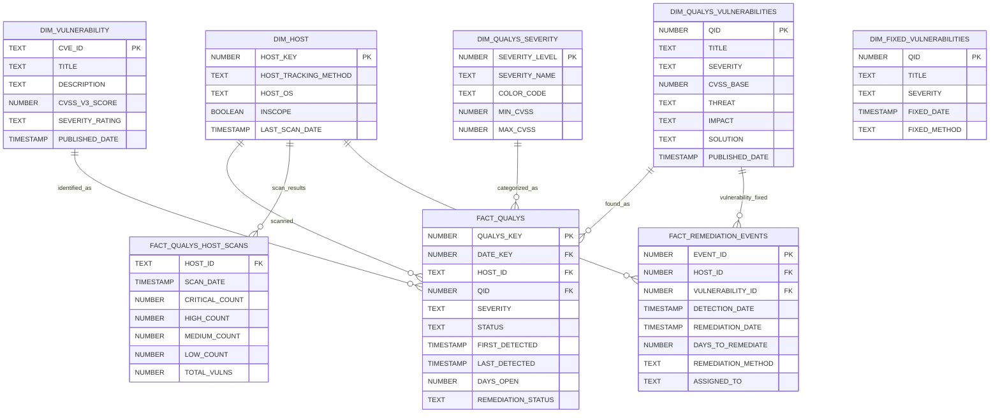
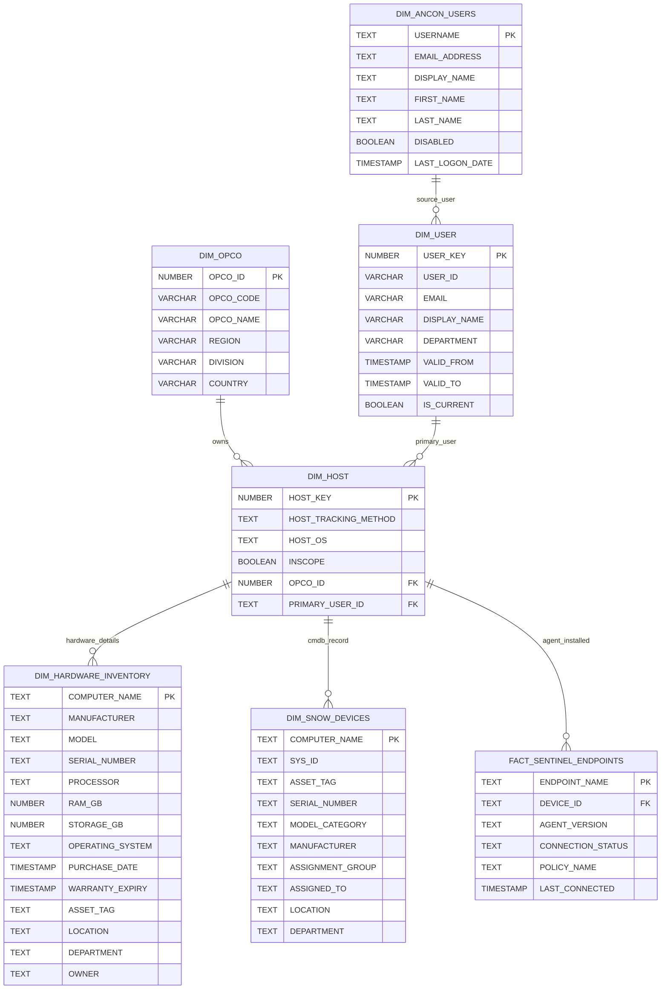
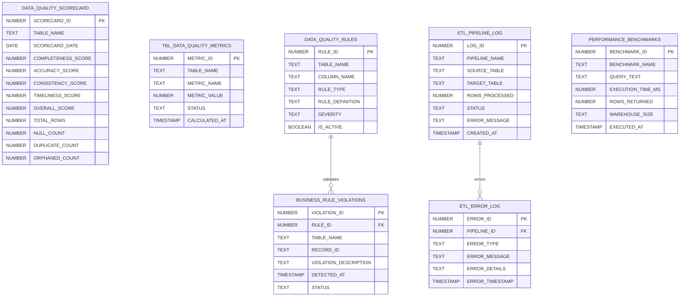
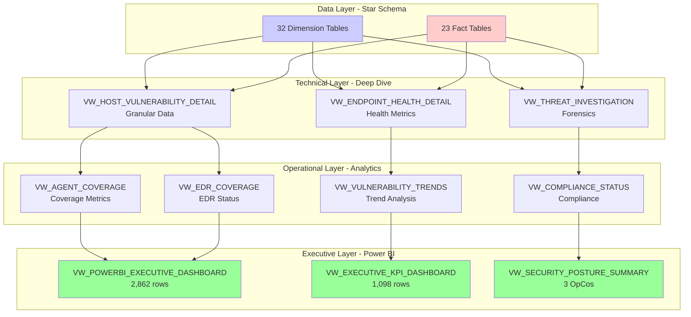
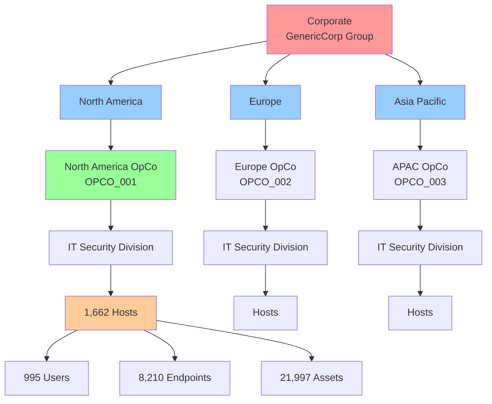
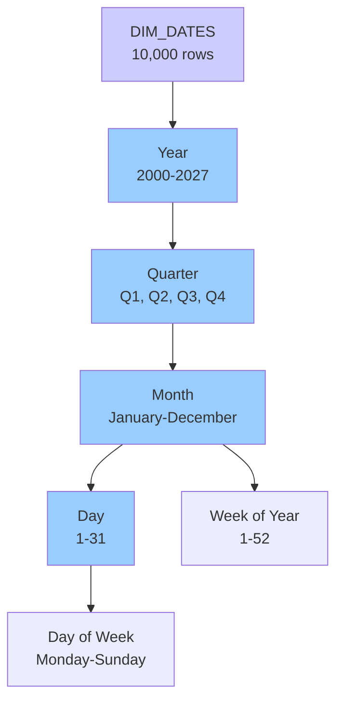

# SECURITY_ANALYTICS Additional ERD Diagrams
**Detailed Entity Relationship Diagrams by Domain**

---

## Table of Contents
1. [Security Domain ERD](#security-domain-erd)
2. [Vulnerability Management ERD](#vulnerability-management-erd)
3. [Asset & Endpoint Management ERD](#asset--endpoint-management-erd)
4. [Data Quality & Monitoring ERD](#data-quality--monitoring-erd)
5. [Real-Time Threat Detection ERD](#real-time-threat-detection-erd)
6. [ETL & Data Lineage ERD](#etl--data-lineage-erd)

---

## Security Domain ERD

### Complete Security Platform Integration

```mermaid
erDiagram
    %% Core Security Dimensions
    DIM_HOST {
        NUMBER HOST_KEY PK
        TEXT HOST_TRACKING_METHOD
        TEXT HOST_OS
        BOOLEAN INSCOPE
        NUMBER OPCO_ID FK
    }

    DIM_OPCO {
        NUMBER OPCO_ID PK
        VARCHAR OPCO_CODE
        VARCHAR OPCO_NAME
        VARCHAR REGION
        VARCHAR DIVISION
    }

    DIM_USER {
        NUMBER USER_KEY PK
        VARCHAR USER_ID
        VARCHAR EMAIL
        VARCHAR DISPLAY_NAME
        TIMESTAMP VALID_FROM
        TIMESTAMP VALID_TO
        BOOLEAN IS_CURRENT
    }

    %% Endpoint Protection Platforms
    DIM_DEFENDER_ENDPOINTS {
        TEXT DEVICE_ID PK
        TEXT DEVICE_NAME
        TEXT COMPLIANCE
        TEXT DEVICE_STATE
        TEXT PRIMARY_USER_UPN
    }

    DIM_CROWDSTRIKE_ENDPOINTS {
        TEXT HOSTNAME PK
        TEXT AGENT_VERSION
        TEXT STATUS
        TEXT PLATFORM_NAME
    }

    DIM_CISCO_AMP {
        TEXT HOSTNAME PK
        TEXT CONNECTOR_GUID
        TEXT OS_VERSION
        TEXT POLICY_NAME
    }

    DIM_SYMANTEC_ENDPOINTS {
        TEXT COMPUTER_NAME PK
        TEXT AGENT_VERSION
        TEXT LAST_UPDATE
        TEXT GROUP_NAME
    }

    DIM_TRELLIX_ENDPOINTS {
        TEXT HOSTNAME PK
        TEXT AGENT_VERSION
        TEXT TAG
        TEXT OS_TYPE
    }

    DIM_MCAFEE_ENDPOINTS {
        TEXT SYSTEM_NAME PK
        TEXT AGENT_VERSION
        TEXT STATUS
    }

    DIM_SOPHOS_ENDPOINTS {
        TEXT HOSTNAME PK
        TEXT TAMPER_PROTECTION
        TEXT HEALTH_STATUS
    }

    %% External Threat Intelligence
    DIM_CYBELANGEL_ALERTS {
        TEXT ALERT_KEY PK
        TEXT ALERT_TYPE
        TEXT SEVERITY
        TEXT CATEGORY
    }

    DIM_ZEROFOX_ASSETS {
        TEXT ASSET_ID PK
        TEXT ASSET_TYPE
        TEXT NETWORK
        TEXT STATUS
    }

    DIM_BITSIGHT_RISK_VECTORS {
        TEXT RISK_VECTOR_LABEL PK
        TEXT CATEGORY
        NUMBER GRADE
    }

    %% Security Facts
    FACT_EDR {
        NUMBER EDR_KEY PK
        TEXT HOST_ID FK
        TEXT EDR_PLATFORM
        NUMBER THREAT_COUNT
        TIMESTAMP LAST_SEEN_DATE
    }

    FACT_DEFENDER_THREATS {
        NUMBER THREAT_ID PK
        TEXT DEVICE_ID FK
        TEXT THREAT_NAME
        TEXT SEVERITY_LEVEL
        TEXT STATUS
    }

    FACT_CYBELANGEL_THREATS {
        TEXT THREAT_KEY PK
        TEXT ALERT_KEY FK
        TEXT THREAT_TYPE
        TEXT SEVERITY
    }

    FACT_BITSIGHT_FINDINGS {
        TEXT FINDING_KEY PK
        TEXT RISK_VECTOR_ID FK
        TEXT SEVERITY
        TEXT AFFECTS_RATING
    }

    %% Relationships
    DIM_OPCO ||--o{ DIM_HOST : "operates"
    DIM_HOST ||--o{ FACT_EDR : "monitored"
    DIM_DEFENDER_ENDPOINTS ||--o{ FACT_DEFENDER_THREATS : "generates"
    DIM_CYBELANGEL_ALERTS ||--o{ FACT_CYBELANGEL_THREATS : "triggers"
    DIM_BITSIGHT_RISK_VECTORS ||--o{ FACT_BITSIGHT_FINDINGS : "identified_in"
```



---

## Vulnerability Management ERD

### Qualys Vulnerability Scanning Architecture



---

## Asset & Endpoint Management ERD

### IT Asset Inventory & Tracking



---

## Data Quality & Monitoring ERD

### Data Quality Framework Architecture



---

## Real-Time Threat Detection ERD

### Near Real-Time Security Event Processing

```mermaid
erDiagram
    %% Landing - Real-time ingestion
    L_EDR_THREATS_REALTIME {
        TEXT THREAT_ID PK
        TEXT HOST_ID
        TEXT THREAT_NAME
        TEXT SEVERITY
        TEXT EDR_PLATFORM
        TIMESTAMP DETECTED_AT
        TEXT STATUS
        TEXT RESPONSE_ACTION
    }

    L_CRITICAL_VULNS_REALTIME {
        TEXT VULN_ID PK
        TEXT HOST_ID
        TEXT CVE_ID
        NUMBER CVSS_SCORE
        TEXT SEVERITY
        TIMESTAMP DISCOVERED_AT
        TEXT EXPLOIT_AVAILABLE
    }

    %% Transformation - Business logic
    FACT_EDR {
        NUMBER EDR_KEY PK
        NUMBER DATE_KEY FK
        TEXT HOST_ID FK
        TEXT ENDPOINT_ID FK
        TEXT EDR_PLATFORM
        TEXT AGENT_STATUS
        NUMBER THREAT_COUNT
        TIMESTAMP LAST_SEEN_DATE
    }

    DIM_HOST {
        NUMBER HOST_KEY PK
        TEXT HOST_OS
        NUMBER OPCO_ID FK
    }

    DIM_DATES {
        TIMESTAMP DATE PK
        NUMBER YEAR
        NUMBER QUARTER
        TEXT MONTH_NAME
    }

    %% Reporting - Real-time dashboards
    VW_REALTIME_THREAT_ALERTS {
        TEXT THREAT_ID
        TEXT HOST_NAME
        TEXT THREAT_NAME
        TEXT SEVERITY
        TEXT OPCO_NAME
        TIMESTAMP DETECTED_AT
        TEXT STATUS
    }

    VW_CRITICAL_VULNS_DASHBOARD {
        TEXT VULN_ID
        TEXT HOST_NAME
        TEXT CVE_ID
        NUMBER CVSS_SCORE
        TEXT OPCO_NAME
        TIMESTAMP DISCOVERED_AT
        NUMBER HOURS_OPEN
    }

    %% Data flow
    L_EDR_THREATS_REALTIME -.->|Snowpipe Continuous| FACT_EDR
    L_CRITICAL_VULNS_REALTIME -.->|Snowpipe Continuous| FACT_EDR
    FACT_EDR --> VW_REALTIME_THREAT_ALERTS
    FACT_EDR --> VW_CRITICAL_VULNS_DASHBOARD
    DIM_HOST --> VW_REALTIME_THREAT_ALERTS
    DIM_HOST --> VW_CRITICAL_VULNS_DASHBOARD
```

---

## ETL & Data Lineage ERD

### Complete Data Lineage Tracking

```mermaid
erDiagram
    DATA_LINEAGE_CATALOG {
        NUMBER LINEAGE_ID PK
        TEXT SOURCE_DATABASE
        TEXT SOURCE_SCHEMA
        TEXT SOURCE_TABLE
        TEXT TARGET_DATABASE
        TEXT TARGET_SCHEMA
        TEXT TARGET_TABLE
        TEXT TRANSFORMATION_LOGIC
        TEXT ETL_PROCEDURE
        TEXT UPDATE_FREQUENCY
        TEXT DATA_OWNER
        TIMESTAMP LAST_UPDATED
    }

    ETL_PIPELINE_LOG {
        NUMBER LOG_ID PK
        TEXT PIPELINE_NAME
        TEXT SOURCE_TABLE
        TEXT TARGET_TABLE
        NUMBER ROWS_PROCESSED
        TEXT STATUS
        TIMESTAMP CREATED_AT
    }

    ETL_ORCHESTRATION_LOG {
        NUMBER ORCHESTRATION_ID PK
        TEXT ORCHESTRATION_NAME
        TEXT PIPELINE_SEQUENCE
        TIMESTAMP START_TIME
        TIMESTAMP END_TIME
        TEXT STATUS
    }

    DATA_DICTIONARY {
        NUMBER DICT_ID PK
        TEXT TABLE_NAME
        TEXT COLUMN_NAME
        TEXT DATA_TYPE
        TEXT BUSINESS_NAME
        TEXT DESCRIPTION
        BOOLEAN IS_PK
        BOOLEAN IS_FK
        TEXT FK_REFERENCES
        TEXT SAMPLE_VALUES
    }

    %% Transformation Procedures
    SP_POPULATE_FACT_TABLES {
        TEXT PROCEDURE_NAME PK
        TEXT LOGIC "Populates all fact tables from landing"
    }

    SP_REFRESH_DIMENSIONS {
        TEXT PROCEDURE_NAME PK
        TEXT LOGIC "Refreshes dimension tables with SCD"
    }

    SP_CALCULATE_DATA_QUALITY_SCORE {
        TEXT PROCEDURE_NAME PK
        TEXT LOGIC "Calculates DQ scores for all tables"
    }

    %% Scheduled Tasks
    TASK_DAILY_HEALTH_CHECK {
        TEXT TASK_NAME PK
        TEXT SCHEDULE "Daily at 6 AM"
        TEXT WAREHOUSE "DEV_WH"
    }

    TASK_DATA_QUALITY_MONITOR {
        TEXT TASK_NAME PK
        TEXT SCHEDULE "Every 4 hours"
        TEXT WAREHOUSE "DEV_WH"
    }

    DATA_LINEAGE_CATALOG ||--o{ ETL_PIPELINE_LOG : "tracks_execution"
    ETL_ORCHESTRATION_LOG ||--o{ ETL_PIPELINE_LOG : "orchestrates"
    TASK_DAILY_HEALTH_CHECK -.->|calls| SP_POPULATE_FACT_TABLES
    TASK_DATA_QUALITY_MONITOR -.->|calls| SP_CALCULATE_DATA_QUALITY_SCORE
```

---

## Power BI Integration ERD

### Semantic Layer for Executive Dashboards

```mermaid
erDiagram
    %% Core Star Schema for Power BI
    VW_POWERBI_EXECUTIVE_DASHBOARD {
        TIMESTAMP Date PK
        NUMBER Year
        NUMBER Quarter
        TEXT Month_Name
        TEXT Operating_Company
        TEXT Region
        TEXT Division
        NUMBER EDR_Coverage_Pct
        NUMBER Vulnerability_Count
        NUMBER Critical_Vulns
        NUMBER Threat_Count
        NUMBER Assets_Total
        NUMBER Assets_Compliant
    }

    DIM_DATES {
        TIMESTAMP DATE PK
        NUMBER YEAR
        NUMBER QUARTER
        TEXT MONTH_NAME
    }

    DIM_OPCO {
        NUMBER OPCO_ID PK
        VARCHAR OPCO_NAME
        VARCHAR REGION
        VARCHAR DIVISION
    }

    DIM_HOST {
        NUMBER HOST_KEY PK
        NUMBER OPCO_ID FK
    }

    FACT_EDR {
        NUMBER EDR_KEY PK
        NUMBER DATE_KEY FK
        TEXT HOST_ID FK
        NUMBER THREAT_COUNT
    }

    FACT_QUALYS {
        NUMBER QUALYS_KEY PK
        NUMBER DATE_KEY FK
        TEXT HOST_ID FK
        NUMBER QID FK
    }

    TBL_KPI_MASTER {
        NUMBER KPI_ID PK
        TEXT KPI_NAME
        TEXT KPI_CATEGORY
        TEXT CALCULATION_LOGIC
        TEXT OWNER
    }

    %% Power BI Aggregations
    VW_EXECUTIVE_KPI_DASHBOARD {
        TEXT OPCO_NAME
        TEXT REGION
        NUMBER TOTAL_HOSTS
        NUMBER HOSTS_WITH_THREATS
        NUMBER TOTAL_THREATS
        NUMBER THREAT_PERCENTAGE
    }

    VW_SECURITY_POSTURE_SUMMARY {
        TEXT OPCO_NAME
        TEXT REGION
        NUMBER TOTAL_ASSETS
        NUMBER EDR_DEPLOYMENTS
        NUMBER TOTAL_THREATS_DETECTED
        NUMBER DAYS_SINCE_LAST_SCAN
    }

    DIM_DATES --> VW_POWERBI_EXECUTIVE_DASHBOARD
    DIM_OPCO --> VW_POWERBI_EXECUTIVE_DASHBOARD
    DIM_HOST --> VW_POWERBI_EXECUTIVE_DASHBOARD
    FACT_EDR --> VW_POWERBI_EXECUTIVE_DASHBOARD
    FACT_QUALYS --> VW_POWERBI_EXECUTIVE_DASHBOARD
    TBL_KPI_MASTER -.->|defines| VW_EXECUTIVE_KPI_DASHBOARD
```

---

## Business Intelligence Views Hierarchy



---

## Dimensional Hierarchy Diagrams

### Geographic & Organizational Hierarchy



### Time Dimension Hierarchy



---

**Document Version:** 1.0
**Created:** October 7, 2025
**Purpose:** Detailed ERD diagrams for specific domains within SECURITY_ANALYTICS Data Warehouse
