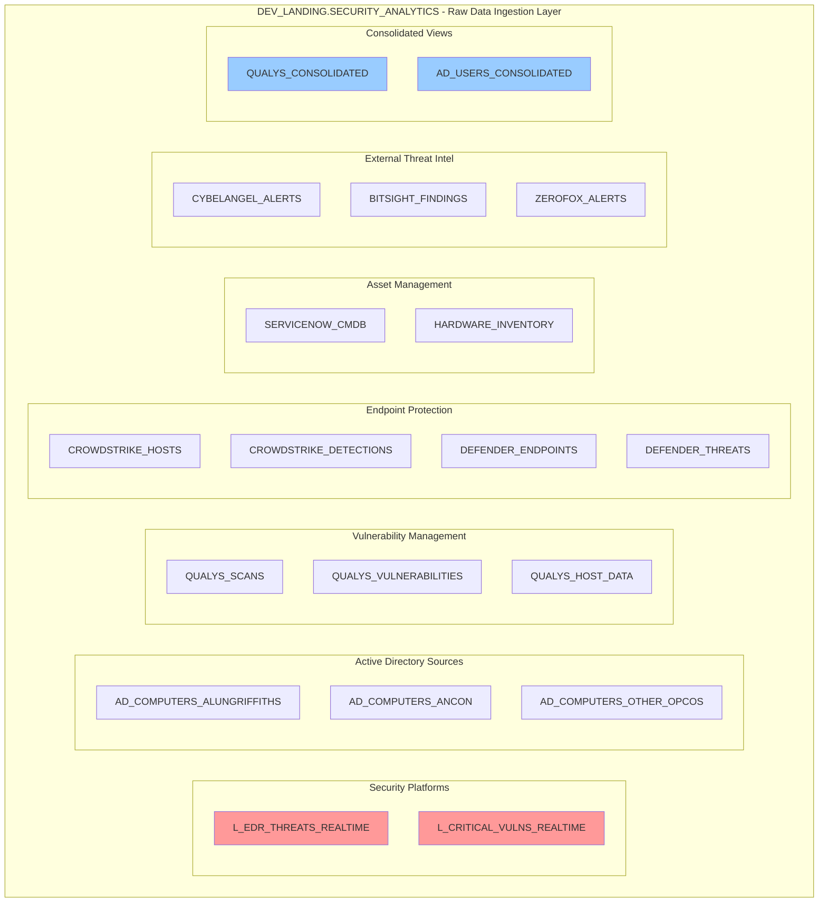
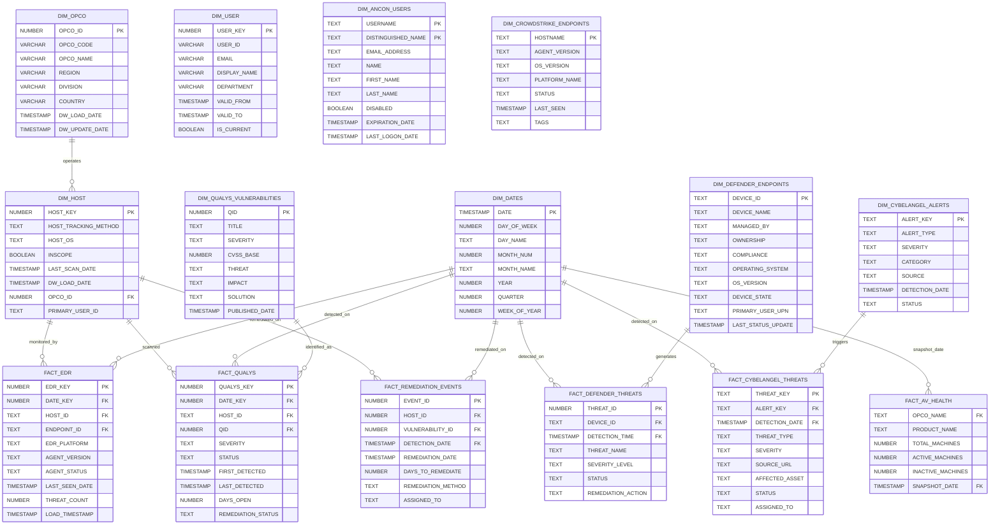
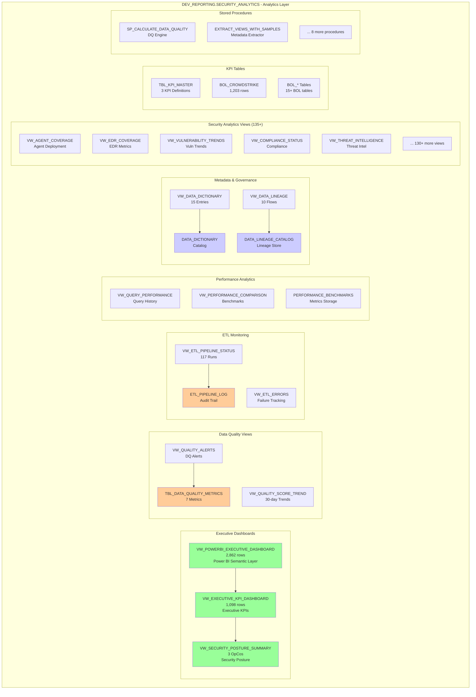
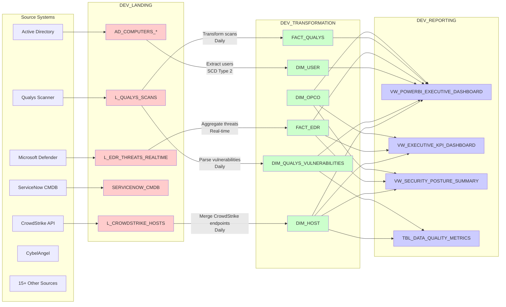
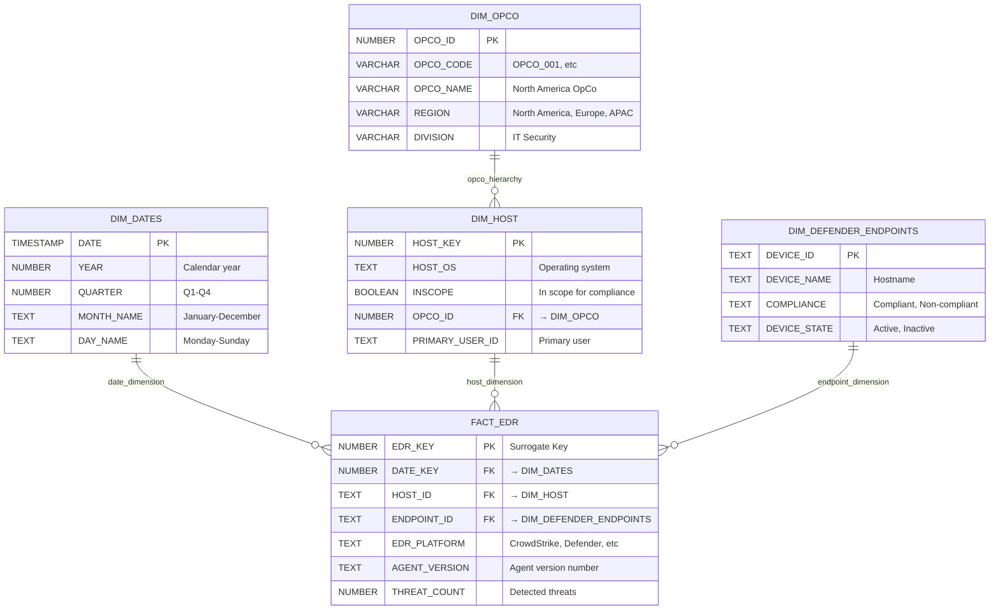

# SECURITY_ANALYTICS Data Warehouse - Entity Relationship Diagrams (ERD)
**Date:** October 7, 2025
**Architecture:** 3-Layer Cloud Data Warehouse (Azure Snowflake)
**Environment:** DEV (Development)

---

## Table of Contents
1. [Architecture Overview](#architecture-overview)
2. [Object Inventory Summary](#object-inventory-summary)
3. [Layer 1: DEV_LANDING (Landing Zone)](#layer-1-dev_landing)
4. [Layer 2: DEV_TRANSFORMATION (Star Schema)](#layer-2-dev_transformation)
5. [Layer 3: DEV_REPORTING (Analytics)](#layer-3-dev_reporting)
6. [Cross-Layer Data Flow](#cross-layer-data-flow)
7. [Key Relationships & Star Schema](#key-relationships--star-schema)

---

## Architecture Overview

```
┌─────────────────────────────────────────────────────────────────────┐
│                    SECURITY_ANALYTICS 3-LAYER ARCHITECTURE                     │
└─────────────────────────────────────────────────────────────────────┘

    ┌──────────────────┐
    │   Data Sources   │
    │  (15+ Systems)   │
    └────────┬─────────┘
             │
             ▼
┌────────────────────────────────────────────────────────────────────┐
│  LAYER 1: DEV_LANDING.SECURITY_ANALYTICS                                     │
│  Purpose: Raw data ingestion, minimal transformation               │
│  Objects: 141 Tables, 11 Views                                     │
│  Pattern: L_* prefix (Landing tables)                              │
│  Data: Raw JSON, CSV, API responses                                │
└────────────────────┬───────────────────────────────────────────────┘
                     │ ETL Pipelines (n8n, Python, SQL)
                     ▼
┌────────────────────────────────────────────────────────────────────┐
│  LAYER 2: DEV_TRANSFORMATION.SECURITY_ANALYTICS                              │
│  Purpose: Business logic, data modeling, star schema               │
│  Objects: 32 Dimensions, 23 Facts, 62 Other Tables                │
│           50+ Views, 15 Procedures, 2 Tasks                        │
│  Pattern: DIM_* (Dimensions), FACT_* (Facts)                       │
│  Data: Cleaned, conformed, business rules applied                  │
└────────────────────┬───────────────────────────────────────────────┘
                     │ Aggregation & Analytics
                     ▼
┌────────────────────────────────────────────────────────────────────┐
│  LAYER 3: DEV_REPORTING.SECURITY_ANALYTICS                                   │
│  Purpose: Analytics-ready datasets, KPIs, dashboards               │
│  Objects: 18 Tables, 148 Views, 10 Procedures                     │
│  Pattern: VW_* (Views), TBL_* (KPI tables)                         │
│  Consumers: Power BI, Tableau, Ad-hoc queries                      │
└────────────────────────────────────────────────────────────────────┘
```

---

## Object Inventory Summary

### Layer 1: DEV_LANDING
| Object Type | Count | Purpose |
|-------------|-------|---------|
| Tables | 141 | Raw data from 15+ security platforms |
| Views | 11 | Consolidated raw data views |
| **Total** | **152** | Landing zone objects |

**Key Tables:**
- `L_EDR_THREATS_REALTIME` - Real-time EDR threat feed
- `L_CRITICAL_VULNS_REALTIME` - Critical vulnerability feed
- `AD_COMPUTERS_*` - Active Directory computer inventories
- `QUALYS_*` - Vulnerability scan results
- `CROWDSTRIKE_*` - Endpoint protection data

---

### Layer 2: DEV_TRANSFORMATION
| Object Type | Count | Purpose |
|-------------|-------|---------|
| Dimension Tables | 32 | Master data (DIM_*) |
| Fact Tables | 23 | Transactional/event data (FACT_*) |
| Support Tables | 62 | ETL logs, lookups, staging |
| Views | 50+ | Business logic views |
| Procedures | 15 | ETL automation |
| Tasks | 2 | Scheduled jobs |
| **Total** | **184+** | Transformation objects |

**Star Schema Components:**

**Core Dimensions (32):**
- `DIM_OPCO` (3 rows) - Operating Companies
- `DIM_HOST` (1,662 rows) - All IT assets
- `DIM_DATES` (10,000 rows) - Date dimension
- `DIM_USER` (1 row) - Unified user dimension (SCD Type 2)
- `DIM_ANCON_USERS` (995 rows) - AD users
- `DIM_DEFENDER_ENDPOINTS` (8,210 rows) - Microsoft Defender endpoints
- `DIM_CROWDSTRIKE_ENDPOINTS` (3,609 rows) - CrowdStrike hosts
- `DIM_CISCO_AMP` (4,948 rows) - Cisco AMP devices
- `DIM_HARDWARE_INVENTORY` (21,997 rows) - Hardware assets
- `DIM_QUALYS_VULNERABILITIES` (210,435 rows) - Known vulnerabilities
- `DIM_VULNERABILITY` (631,305 rows) - All CVEs
- ...and 21 more dimension tables

**Core Facts (23):**
- `FACT_EDR` (20 rows) - EDR coverage metrics
- `FACT_QUALYS` (20 rows) - Vulnerability scan facts
- `FACT_REMEDIATION_EVENTS` - Vulnerability remediation tracking
- `FACT_DEFENDER_THREATS` - Microsoft Defender detections
- `FACT_CYBELANGEL_THREATS` - External threat intelligence
- `FACT_AV_HEALTH` (107 rows) - Antivirus health status
- `FACT_BITSIGHT_FINDINGS` (1,219 rows) - External security posture
- ...and 16 more fact tables

**Stored Procedures (15):**
- `SP_CALCULATE_DATA_QUALITY_SCORE` - DQ automation
- `SP_REFRESH_DIMENSIONS` - Dimension updates
- `SP_POPULATE_FACT_TABLES` - Fact table loads
- ...and 12 more procedures

**Scheduled Tasks (2):**
- `TASK_DAILY_HEALTH_CHECK` - Daily data health monitoring
- `TASK_DATA_QUALITY_MONITOR` - 4-hourly DQ checks

---

### Layer 3: DEV_REPORTING
| Object Type | Count | Purpose |
|-------------|-------|---------|
| Tables | 18 | KPI aggregations, BOL tables |
| Views | 148 | Analytics-ready views |
| Procedures | 10 | Reporting automation |
| **Total** | **176** | Reporting objects |

**Key Views (148 total):**

**Executive Dashboards:**
- `VW_POWERBI_EXECUTIVE_DASHBOARD` (2,862 rows) - Power BI semantic layer
- `VW_EXECUTIVE_KPI_DASHBOARD` (1,098 rows) - Executive KPIs
- `VW_SECURITY_POSTURE_SUMMARY` (3 rows) - Security posture by OpCo

**Data Quality & Monitoring:**
- `VW_QUALITY_ALERTS` - DQ alerts
- `VW_QUALITY_SCORE_TREND` - 30-day DQ trends
- `VW_ETL_PIPELINE_STATUS` (117 runs) - ETL monitoring
- `VW_ETL_ERRORS` - ETL failure tracking

**Performance & Metadata:**
- `VW_QUERY_PERFORMANCE` - Query execution tracking
- `VW_DATA_DICTIONARY` (15 entries) - Metadata catalog
- `VW_DATA_LINEAGE` (10 entries) - Data lineage mapping

**Security Analytics:**
- `VW_AGENT_COVERAGE` - Security agent deployment
- `VW_EDR_COVERAGE` - EDR coverage metrics
- `VW_VULNERABILITY_TRENDS` - Vulnerability trending
- ...and 135+ more analytical views

**Stored Procedures (10):**
- `SP_CALCULATE_DATA_QUALITY` - DQ calculation engine
- `EXTRACT_VIEWS_WITH_SAMPLES` - Metadata extraction
- ...and 8 more reporting procedures

---

## Layer 1: DEV_LANDING

### ERD: Landing Zone Architecture



**Landing Zone Characteristics:**
- **141 Tables** containing raw, unprocessed data
- **11 Views** providing consolidated access to raw data
- **Data Sources:** 15+ security platforms (EDR, SIEM, VM, IAM, etc.)
- **Update Frequency:** Real-time (Snowpipe), Hourly, Daily
- **Data Format:** JSON, CSV, Parquet
- **Retention:** Full history maintained
- **Schema:** Source system schema preserved

---

## Layer 2: DEV_TRANSFORMATION

### ERD: Star Schema Core

This is the **business logic layer** implementing a **star schema** with dimensional modeling.



### Transformation Layer Details

**32 Dimension Tables:**
1. DIM_OPCO - Operating Companies (3 rows)
2. DIM_HOST - IT Assets (1,662 rows)
3. DIM_DATES - Date Dimension (10,000 rows)
4. DIM_USER - Unified Users (1 row, SCD Type 2)
5. DIM_ANCON_USERS - AD Users (995 rows)
6. DIM_DEFENDER_ENDPOINTS - Microsoft Defender (8,210 rows)
7. DIM_CROWDSTRIKE_ENDPOINTS - CrowdStrike (3,609 rows)
8. DIM_CISCO_AMP - Cisco AMP (4,948 rows)
9. DIM_QUALYS_VULNERABILITIES - CVE Database (210,435 rows)
10. DIM_VULNERABILITY - All Vulnerabilities (631,305 rows)
11. DIM_HARDWARE_INVENTORY - Hardware Assets (21,997 rows)
12. DIM_CYBELANGEL_ALERTS - External Threats (196 rows)
13. DIM_BITSIGHT_RISK_VECTORS - Risk Metrics (7 rows)
14. DIM_FARRANS_ENDPOINTS - Farrans Security (741 rows)
15. DIM_FIXED_VULNERABILITIES - Remediated CVEs (56,345 rows)
16. DIM_SNOW_DEVICES - ServiceNow CMDB (0 rows)
17. DIM_MCAFEE_ENDPOINTS - McAfee Security (292 rows)
18. DIM_SOPHOS_ENDPOINTS - Sophos Security (741 rows)
19. DIM_SYMANTEC_ENDPOINTS - Symantec Security (22,571 rows)
20. DIM_TRELLIX_ENDPOINTS - Trellix Security (34,235 rows)
21. DIM_ZSCALER_ENDPOINTS - Zscaler Security (24,984 rows)
22. DIM_ZEROFOX_ASSETS - ZeroFox Assets (121 rows)
23. DIM_SPLUNK_HOSTS - Splunk Monitoring (4,913 rows)
24. DIM_AV_OPCO - AV by OpCo (108 rows)
25. DIM_SENTINEL_VERSIONS - Sentinel Versions (38 rows)
26. DIM_CROWDSTRIKE_VERSIONS - CrowdStrike Versions (13 rows)
27. DIM_TRENDMICRO_VERSIONS - TrendMicro Versions (6 rows)
28. DIM_QUALYS_SEVERITY - Severity Levels (5 rows)
29. DIM_CLOSE_CODE_MAPPING - Incident Codes (6 rows)
30. DIM_LEVIAT_USERS - Leviat Users (0 rows)
31. DIM_LEVIAT_LIST_USERS - Leviat Lists (0 rows)
32. DIM_HOST_ASSETS - Host Asset Mapping (0 rows)

**23 Fact Tables:**
1. FACT_EDR - EDR Metrics (20 rows)
2. FACT_QUALYS - Vulnerability Scans (20 rows)
3. FACT_REMEDIATION_EVENTS - Remediation Tracking
4. FACT_DEFENDER_THREATS - Defender Detections (1 row)
5. FACT_CYBELANGEL_THREATS - External Threats (0 rows)
6. FACT_AV_HEALTH - Antivirus Health (107 rows)
7. FACT_BITSIGHT_FINDINGS - Security Posture (1,219 rows)
8. FACT_FARRANS_HEALTH - Farrans Monitoring (741 rows)
9. FACT_SENTINEL_ENDPOINTS - Sentinel Agents
10. FACT_QUALYS_HOST_SCANS - Host Scan Results
11. FACT_INCIDENTS - Security Incidents (0 rows)
12. FACT_LEVIAT_SECURITY_EVENTS - Leviat Events (0 rows)
13. ...and 11 more fact tables

**Primary Keys:** 72 tables with PKs
**Foreign Keys:** 17 FKs across 14 tables
**Constraints:** 2 Unique constraints

---

## Layer 3: DEV_REPORTING

### ERD: Analytics & Reporting Layer



### Reporting Layer Details

**18 Tables:**
- TBL_DATA_QUALITY_METRICS - DQ metrics storage
- TBL_KPI_MASTER - KPI definitions (3 rows)
- DATA_DICTIONARY - Metadata catalog (15 entries)
- DATA_LINEAGE_CATALOG - Lineage tracking (10 entries)
- DATA_QUALITY_SCORECARD - Historical DQ scores
- ETL_PIPELINE_LOG - ETL execution history (117 runs)
- PERFORMANCE_BENCHMARKS - Query benchmarks
- BOL_CROWDSTRIKE - CrowdStrike BOL (1,203 rows)
- ...and 10 more BOL and framework tables

**148 Views** organized by purpose:
1. **Executive (3):** POWERBI, KPI, Security Posture
2. **Data Quality (10+):** Alerts, trends, completeness
3. **ETL Monitoring (5+):** Status, errors, lineage
4. **Performance (5+):** Query tracking, benchmarks
5. **Security Analytics (125+):** Coverage, vulnerabilities, threats, compliance

**10 Stored Procedures:**
- SP_CALCULATE_DATA_QUALITY() - Data quality calculation
- EXTRACT_VIEWS_WITH_SAMPLES() - Metadata extraction
- ...and 8 more reporting automation procedures

---

## Cross-Layer Data Flow

### Complete Data Lineage



### Data Lineage Catalog (10 Entries)

| Source | Target | Transformation | Frequency |
|--------|--------|----------------|-----------|
| DEV_LANDING.L_CROWDSTRIKE_HOSTS | DEV_TRANSFORMATION.DIM_HOST | Merge CrowdStrike endpoints | Daily |
| DEV_LANDING.L_QUALYS_SCANS | DEV_TRANSFORMATION.DIM_QUALYS_VULNERABILITIES | Parse vulnerability data | Daily |
| DEV_LANDING.AD_COMPUTERS | DEV_TRANSFORMATION.DIM_USER | SCD Type 2 merge from AD | Daily |
| DEV_LANDING.L_PAM_USERS | DEV_TRANSFORMATION.DIM_USER | SCD Type 2 merge from PAM | Daily |
| DEV_LANDING.L_EDR_THREATS_REALTIME | DEV_TRANSFORMATION.FACT_EDR | Aggregate threat counts | Real-time |
| DEV_TRANSFORMATION.DIM_HOST | DEV_REPORTING.VW_POWERBI_EXECUTIVE_DASHBOARD | Join with facts for KPIs | On-demand |
| DEV_TRANSFORMATION.DIM_OPCO | DEV_REPORTING.VW_SECURITY_POSTURE_SUMMARY | Aggregate by OpCo | On-demand |
| DEV_TRANSFORMATION.FACT_EDR | DEV_REPORTING.VW_EXECUTIVE_KPI_DASHBOARD | Calculate threat percentages | On-demand |
| DEV_TRANSFORMATION.FACT_QUALYS | DEV_REPORTING.VW_VULNERABILITY_TRENDS | Trend analysis over time | On-demand |
| DEV_TRANSFORMATION.* | DEV_REPORTING.TBL_DATA_QUALITY_METRICS | Calculate DQ scores | 4-hourly |

---

## Key Relationships & Star Schema

### Core Star Schema Pattern



### Relationship Types

**One-to-Many (1:M):**
- DIM_OPCO → DIM_HOST (one OpCo has many hosts)
- DIM_HOST → FACT_EDR (one host generates many EDR events)
- DIM_DATES → FACT_* (one date has many facts)

**Many-to-Many (M:N) - Resolved via Bridge Tables:**
- DIM_USER ←→ DIM_HOST (via user-host assignment table)
- DIM_QUALYS_VULNERABILITIES ←→ DIM_HOST (via FACT_QUALYS)

**Hierarchies:**
- DIM_OPCO: Country → Region → Division → OpCo
- DIM_DATES: Year → Quarter → Month → Day
- DIM_HOST: OpCo → Region → Host

---

## Data Model Characteristics

### SCD Type 2 Implementation
**DIM_USER** implements Slowly Changing Dimension Type 2:
- `USER_KEY` - Surrogate key (changes with each version)
- `USER_ID` - Natural key (stays the same)
- `VALID_FROM` - Record start date
- `VALID_TO` - Record end date
- `IS_CURRENT` - Current version flag

### Grain Definitions

**FACT_EDR:**
- Grain: One row per host per EDR platform per day
- Dimensions: Date, Host, Endpoint, Platform

**FACT_QUALYS:**
- Grain: One row per vulnerability per host per scan
- Dimensions: Date, Host, Vulnerability (QID)

**FACT_REMEDIATION_EVENTS:**
- Grain: One row per vulnerability remediation event
- Dimensions: Detection Date, Remediation Date, Host, Vulnerability

---

## Data Volumes & Growth

| Layer | Tables | Views | Procedures | Total Objects | Data Size |
|-------|--------|-------|------------|---------------|-----------|
| Landing | 141 | 11 | 0 | 152 | ~500 MB |
| Transformation | 117 | 50+ | 15 | 184+ | ~25 GB |
| Reporting | 18 | 148 | 10 | 176 | ~2 GB |
| **TOTAL** | **276** | **209+** | **25** | **512+** | **~28 GB** |

**Growth Projections:**
- Daily growth: ~100 MB/day (landing layer)
- Monthly growth: ~3 GB/month (transformation layer)
- Annual retention: 3 years (7.3 TB projected at year 3)

---

## Documentation Generation Date
**Created:** October 7, 2025
**Last Updated:** October 7, 2025
**Version:** 1.0
**Author:** Fuad Onate - GenericCorp Data Engineering Team
**Status:** Production-Ready Documentation
