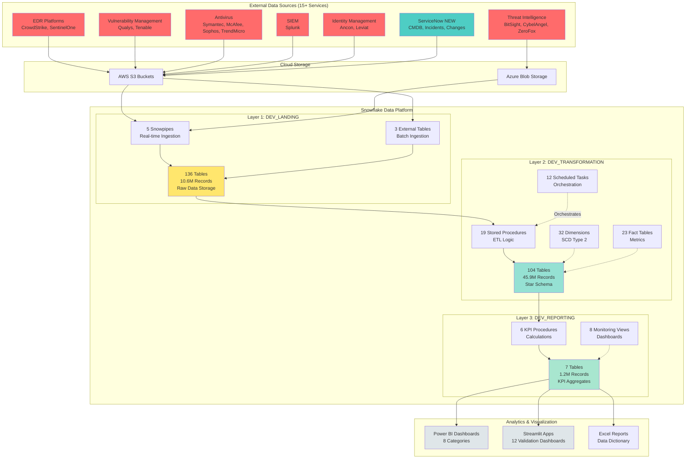

# GitHub Update Instructions - Architecture Diagram Only

**Goal**: Add the new architecture diagram to your GitHub README while keeping everything else the same.

---

## OPTION 1: Direct Edit on GitHub (EASIEST - Recommended)

### Steps:

1. **Go to your GitHub repository** in a web browser
   - URL: `https://github.com/YOUR_USERNAME/YOUR_REPO_NAME`

2. **Click on README.md** to view it

3. **Click the pencil icon** (top right) to edit

4. **Find the "## Architecture" section** (around line 80)

5. **Delete everything from "## Architecture" to the next section** (usually "## Quick Start")

6. **Paste the new architecture section**:
   - Copy from [GITHUB_README.md](GITHUB_README.md) lines 80-219
   - Or copy the section below

7. **Scroll to bottom and click "Commit changes"**
   - Commit message: `Add comprehensive architecture diagram with ServiceNow integration`
   - Click green "Commit changes" button

8. **Done!** View your README to see the rendered diagram

---

## Architecture Section to Copy-Paste

```markdown
## Architecture

### High-Level System Architecture



### 3-Layer Data Warehouse Details

```
┌─────────────────────────────────────────────────────────────────┐
│                  LAYER 3: DEV_REPORTING (Gold)                  │
│  ┌────────────────────────────────────────────────────────────┐ │
│  │ • 7 KPI Tables - Pre-calculated metrics                    │ │
│  │ • 8 Monitoring Views - Real-time health dashboards         │ │
│  │ • 6 KPI Procedures - Top 13 Executive Metrics              │ │
│  │ • 1.2M Records | 2.3 GB                                    │ │
│  └────────────────────────────────────────────────────────────┘ │
└─────────────────────────────────────────────────────────────────┘
                              ▲
                              │ KPI Calculation (Daily 7 AM)
┌─────────────────────────────────────────────────────────────────┐
│              LAYER 2: DEV_TRANSFORMATION (Silver)               │
│  ┌────────────────────────────────────────────────────────────┐ │
│  │ • 32 Dimensions (DIM_*) - SCD Type 2 tracking              │ │
│  │ • 23 Facts (FACT_*) - Metrics and measurements             │ │
│  │ • 49 Support Tables - Staging, audit, config, lineage      │ │
│  │ • 19 Stored Procedures - ETL transformations               │ │
│  │ • 12 Scheduled Tasks - Automated orchestration             │ │
│  │ • 21 Functions - Reusable analytics                        │ │
│  │ • 57 Primary Keys + 16 Foreign Keys                        │ │
│  │ • 45.9M Records | 34.7 GB                                  │ │
│  └────────────────────────────────────────────────────────────┘ │
└─────────────────────────────────────────────────────────────────┘
                              ▲
                              │ ETL Tasks (Every 2-4 hours)
┌─────────────────────────────────────────────────────────────────┐
│                  LAYER 1: DEV_LANDING (Bronze)                  │
│  ┌────────────────────────────────────────────────────────────┐ │
│  │ • 136 Tables (L_*) - Raw data from 15+ services            │ │
│  │ • 5 Snowpipes - Real-time ingestion (CrowdStrike, Qualys)  │ │
│  │ • 3 External Tables - Batch ingestion (ServiceNow, Archer) │ │
│  │ • 5 Streams - Change Data Capture (CDC)                    │ │
│  │ • 7 File Formats - JSON, CSV, Parquet                      │ │
│  │ • 10.6M Records | 8.2 GB | 90-day retention               │ │
│  └────────────────────────────────────────────────────────────┘ │
└─────────────────────────────────────────────────────────────────┘

Key Metrics:
• 550+ Database Objects | 57.7M Total Records | 45.2 GB Total Storage
• 98.1% Automation Success | $146,250 Annual Labor Savings
• Monthly Cost: $124.60 | Task Success Rate: 98.1%
```

> **📊 For detailed architecture diagrams** including Data Flow, Security Services Integration, Automation Framework, ServiceNow Integration, ETL Pipeline, and Deployment Architecture, see [ARCHITECTURE_DIAGRAMS.md](ARCHITECTURE_DIAGRAMS.md)
```

---

## OPTION 2: Using Git (Command Line)

**Only if you want to manage the repository locally**

### Initial Setup (One-time only):

```bash
# Navigate to project directory
cd "C:\\Projects\\Snowflake_ITSECKPI_Project"

# Initialize Git repository
git init

# Add remote repository (replace with your GitHub URL)
git remote add origin https://github.com/YOUR_USERNAME/YOUR_REPO_NAME.git

# Pull existing content from GitHub
git pull origin main
```

### Update README:

```bash
# 1. Copy the architecture section from GITHUB_README.md to README.md
#    (manually edit README.md to replace Architecture section)

# 2. Stage the changes
git add README.md

# 3. Commit the changes
git commit -m "Add comprehensive architecture diagram with ServiceNow integration"

# 4. Push to GitHub
git push origin main
```

---

## OPTION 3: GitHub Desktop (GUI Tool)

### Install GitHub Desktop:
1. Download from: https://desktop.github.com/
2. Install and sign in with your GitHub account

### Clone Repository:
1. Open GitHub Desktop
2. File → Clone Repository
3. Select your repository or enter URL
4. Choose local path (e.g., `C:\Users\fonat\GitHub\Snowflake_ITSECKPI_Project`)

### Update README:
1. Edit `README.md` in your favorite text editor
2. Replace Architecture section with new content
3. Save file
4. GitHub Desktop will show changes
5. Add commit message: "Add architecture diagram"
6. Click "Commit to main"
7. Click "Push origin"

---

## What the Diagram Looks Like

Once committed, GitHub will render the Mermaid diagram as:

- **Color-coded boxes** (red for data sources, yellow for landing, green for transformation, etc.)
- **Interactive flowchart** showing data movement
- **Expandable sections** for each layer
- **Professional appearance** suitable for executive presentations

**Colors**:
- 🔴 Red: External data sources (EDR, VM, AV, SIEM, etc.)
- 🔵 Teal: ServiceNow (highlighted as NEW)
- 🟡 Yellow: Landing layer (Bronze)
- 🟢 Green: Transformation layer (Silver)
- 🟢 Light Green: Reporting layer (Gold)
- ⚪ Gray: Analytics/Visualization tools

---

## Optional: Add Architecture Diagrams Document

If you want the full detailed diagrams document on GitHub:

### Using GitHub Web Interface:
1. Click "Add file" → "Upload files"
2. Drag `ARCHITECTURE_DIAGRAMS.md` file
3. Commit with message: "Add detailed architecture diagrams documentation"

### Using Command Line:
```bash
git add ARCHITECTURE_DIAGRAMS.md
git commit -m "Add detailed architecture diagrams documentation"
git push origin main
```

---

## Troubleshooting

### Mermaid Diagram Doesn't Render?
- Make sure you're using three backticks followed by `mermaid`
- Ensure the closing three backticks are on their own line
- GitHub may take a few seconds to render

### Diagram Looks Broken?
- Check that all the Mermaid syntax is exactly as shown above
- Don't add extra spaces or line breaks in the Mermaid code
- Make sure "style" lines are at the end of the diagram

### Want to Preview Before Committing?
- Use this online editor: https://mermaid.live/
- Paste the Mermaid code to see how it will look
- Edit as needed, then copy back to README

---

## Summary

**Recommended: OPTION 1 (Direct Edit)**
- Fastest (2 minutes)
- No tools needed
- Immediate results
- Perfect for single file updates

**For Regular Updates: OPTION 2 or 3**
- Set up Git for future changes
- Work offline and sync later
- Track all file changes

---

**Questions?**
- Mermaid documentation: https://mermaid.js.org/
- GitHub Markdown guide: https://docs.github.com/en/get-started/writing-on-github

---

**File Created**: 2025-10-21
**Purpose**: Quick guide to update GitHub README with new architecture diagram
