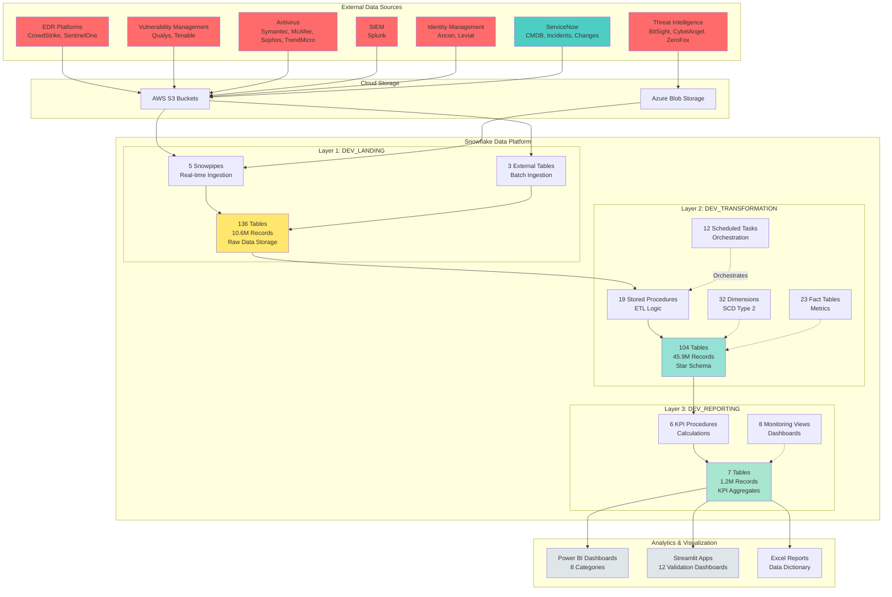
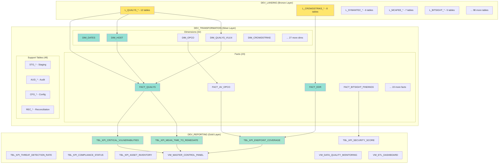
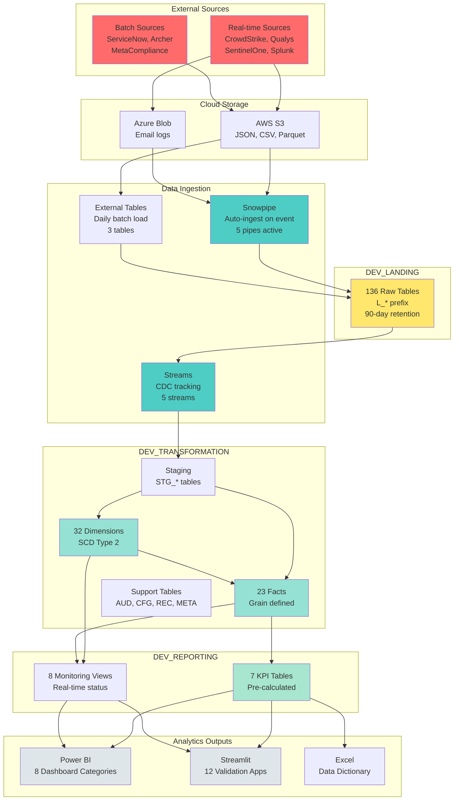
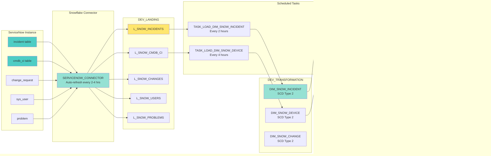
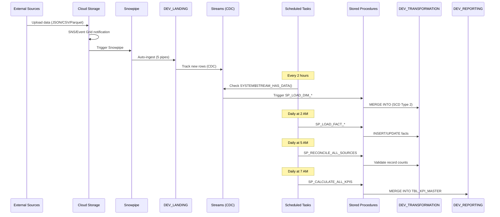

```mermaid
graph TB
    subgraph EDR["Endpoint Detection & Response"]
        CS[CrowdStrike Falcon<br/>21,456 endpoints]
        S1[SentinelOne<br/>2,345 incidents]
        AMP[Cisco AMP<br/>Pending]
        TRX[Trellix<br/>Pending]
        DEF[Microsoft Defender<br/>Pending]
    end

    subgraph AV["Antivirus Solutions"]
        SYM[Symantec<br/>45,678 endpoints]
        MCF[McAfee<br/>34,567 endpoints]
        SOP[Sophos<br/>12,345 endpoints]
        TM[Trend Micro<br/>23,456 endpoints]
    end

    subgraph VM["Vulnerability Management"]
        QLY[Qualys<br/>1.2M vulnerabilities]
        TEN[Tenable<br/>Planned]
    end

    subgraph TI["Threat Intelligence"]
        BS[BitSight<br/>12,801 findings]
        CYB[CybelAngel<br/>1,468 alerts]
        ZF[ZeroFox<br/>4,690 records]
    end

    subgraph IAM["Identity & Access"]
        ANC[Ancon<br/>5,324 users]
        LEV[Leviat<br/>Pending]
    end

    subgraph ITSM["IT Service Management"]
        SNOW[ServiceNow NEW<br/>CMDB + Incidents]
    end

    subgraph SIEM["Security Monitoring"]
        SPL[Splunk<br/>Pending]
    end

    subgraph Landing["DEV_LANDING"]
        LTBL[136 Landing Tables]
    end

    subgraph Trans["DEV_TRANSFORMATION"]
        DIM[32 Dimensions]
        FACT[23 Facts]
    end

    CS --> LTBL
    S1 --> LTBL
    SYM --> LTBL
    MCF --> LTBL
    SOP --> LTBL
    TM --> LTBL
    QLY --> LTBL
    BS --> LTBL
    CYB --> LTBL
    ZF --> LTBL
    ANC --> LTBL
    SNOW --> LTBL

    LTBL --> DIM
    LTBL --> FACT

    style CS fill:#ff6b6b
    style QLY fill:#ff6b6b
    style SNOW fill:#4ecdc4
    style BS fill:#ffd93d
    style LTBL fill:#ffe66d
    style DIM fill:#95e1d3
    style FACT fill:#95e1d3
```

```mermaid
gantt
    title Daily ETL Schedule
    dateFormat HH:mm
    axisFormat %H:%M

    section Dimensions
    TASK_LOAD_DIM_HOST           :02:00, 30m
    TASK_LOAD_DIM_SNOW_DEVICE    :02:00, 30m

    section Facts
    TASK_LOAD_FACT_QUALYS        :02:30, 120m
    TASK_LOAD_DIM_SNOW_INCIDENT  :02:30, 30m

    section Reconciliation
    TASK_RECONCILE_DATA          :05:00, 30m

    section Health Checks
    TASK_DAILY_HEALTH_CHECK      :06:00, 15m
    TASK_CALCULATE_SERVICENOW_KPIS :07:00, 30m

    section Continuous
    TASK_PROCESS_SCD_CHANGES     :active, 00:00, 24h
    TASK_CALCULATE_QUALITY_SCORE :active, 00:00, 24h
    TASK_MONITOR_INGESTION       :active, 00:00, 24h
```

# SECURITY_ANALYTICS Architecture Diagrams

Complete visual architecture documentation for the IT Security KPI Data Warehouse project.

---

## Table of Contents

1. [High-Level Architecture](#1-high-level-architecture)
2. [3-Layer Data Warehouse](#2-3-layer-data-warehouse)
3. [Data Flow Architecture](#3-data-flow-architecture)
4. [Security Services Integration](#4-security-services-integration)
5. [Automation Framework](#5-automation-framework)
6. [ServiceNow Integration](#6-servicenow-integration)
7. [ETL Pipeline Architecture](#7-etl-pipeline-architecture)
8. [Deployment Architecture](#8-deployment-architecture)

---

## 1. High-Level Architecture

### Mermaid Diagram (GitHub-Native)



### ASCII Diagram

```
┌────────────────────────────────────────────────────────────────────────┐
│                      EXTERNAL DATA SOURCES (15+ Services)              │
├─────────────┬──────────────┬─────────────┬──────────────┬──────────────┤
│  EDR (5)    │  VM (2)      │  AV (5)     │  SIEM (1)    │  Threat (3)  │
│ CrowdStrike │  Qualys      │  Symantec   │  Splunk      │  BitSight    │
│ SentinelOne │  Tenable     │  McAfee     │              │  CybelAngel  │
│ Cisco AMP   │              │  Sophos     │              │  ZeroFox     │
│ Trellix     │              │  TrendMicro │              │              │
│ Defender    │              │             │              │              │
├─────────────┴──────────────┴─────────────┴──────────────┴──────────────┤
│                  IAM (2)              │       ServiceNow (NEW)          │
│                  Ancon, Leviat        │       CMDB, Incidents, Changes  │
└───────────────────────────────────────┴─────────────────────────────────┘
                                 │
                                 ▼
┌────────────────────────────────────────────────────────────────────────┐
│                    CLOUD STORAGE LAYER (AWS + Azure)                   │
│  ┌────────────────────────┐         ┌────────────────────────┐         │
│  │   AWS S3 Buckets       │         │  Azure Blob Storage    │         │
│  │   - EDR data (JSON)    │         │  - Email security      │         │
│  │   - Vuln scans (CSV)   │         │  - Proofpoint logs     │         │
│  │   - SIEM logs (Parquet)│         │                        │         │
│  └────────────────────────┘         └────────────────────────┘         │
└────────────────────────────────────────────────────────────────────────┘
                                 │
                                 ▼
┌────────────────────────────────────────────────────────────────────────┐
│                      SNOWFLAKE DATA PLATFORM                           │
│                                                                        │
│  ┌─────────────────────────────────────────────────────────────────┐  │
│  │  LAYER 1: DEV_LANDING (Bronze - Raw Data)                       │  │
│  │  ┌────────────────────────────────────────────────────────────┐ │  │
│  │  │ • 136 Tables (L_*) - 10.6M Records - 8.2 GB              │ │  │
│  │  │ • 5 Snowpipes (Real-time: CrowdStrike, Qualys, Splunk)   │ │  │
│  │  │ • 3 External Tables (Batch: ServiceNow, Archer, MetaC)   │ │  │
│  │  │ • 11 Views (Consolidated source data)                     │ │  │
│  │  │ • Retention: 90 days rolling                              │ │  │
│  │  └────────────────────────────────────────────────────────────┘ │  │
│  └─────────────────────────────────────────────────────────────────┘  │
│                                 │                                      │
│                                 │ ETL Tasks (Every 2-4 hours)          │
│                                 ▼                                      │
│  ┌─────────────────────────────────────────────────────────────────┐  │
│  │  LAYER 2: DEV_TRANSFORMATION (Silver - Business Logic)          │  │
│  │  ┌────────────────────────────────────────────────────────────┐ │  │
│  │  │ • 104 Tables - 45.9M Records - 34.7 GB                    │ │  │
│  │  │   ├─ 32 Dimensions (DIM_*) with SCD Type 2               │ │  │
│  │  │   ├─ 23 Fact Tables (FACT_*)                             │ │  │
│  │  │   └─ 49 Support Tables (STG_*, AUD_*, CFG_*)             │ │  │
│  │  │ • 19 Stored Procedures (SP_*)                            │ │  │
│  │  │ • 21 Functions (10 Scalar + 11 Table-Valued)             │ │  │
│  │  │ • 12 Scheduled Tasks (TASK_*)                            │ │  │
│  │  │ • 57 Primary Keys, 16 Foreign Keys                       │ │  │
│  │  │ • Retention: 3 years                                      │ │  │
│  │  └────────────────────────────────────────────────────────────┘ │  │
│  └─────────────────────────────────────────────────────────────────┘  │
│                                 │                                      │
│                                 │ KPI Procedures (Daily at 7 AM)       │
│                                 ▼                                      │
│  ┌─────────────────────────────────────────────────────────────────┐  │
│  │  LAYER 3: DEV_REPORTING (Gold - Analytics Ready)                │  │
│  │  ┌────────────────────────────────────────────────────────────┐ │  │
│  │  │ • 7 Tables (TBL_KPI_*) - 1.2M Records - 2.3 GB           │ │  │
│  │  │ • 8 Monitoring Views (VW_*)                               │ │  │
│  │  │ • 6 KPI Calculation Procedures                            │ │  │
│  │  │ • Pre-aggregated metrics for dashboards                   │ │  │
│  │  │ • Top 13 Executive KPIs (NIST CSF 2.0)                   │ │  │
│  │  └────────────────────────────────────────────────────────────┘ │  │
│  └─────────────────────────────────────────────────────────────────┘  │
└────────────────────────────────────────────────────────────────────────┘
                                 │
                                 ▼
┌────────────────────────────────────────────────────────────────────────┐
│                   ANALYTICS & VISUALIZATION LAYER                      │
│  ┌─────────────────────┬─────────────────────┬─────────────────────┐  │
│  │   Power BI (8)      │  Streamlit (12)     │  Excel Reports      │  │
│  │ • Executive Dash    │ • CrowdStrike       │ • Data Dictionary   │  │
│  │ • Security Ops      │ • Qualys            │ • Complete Inventory│  │
│  │ • Compliance        │ • Splunk            │ • 3-Layer Analysis  │  │
│  │ • Vulnerability     │ • BitSight          │ • ERD Documentation │  │
│  │ • Endpoint Sec      │ • + 8 more apps     │                     │  │
│  └─────────────────────┴─────────────────────┴─────────────────────┘  │
└────────────────────────────────────────────────────────────────────────┘

Key Metrics:
• 550+ Database Objects | 57.7M Total Records | 45.2 GB Total Storage
• 98.1% Automation (52/53 objects) | $146,250 Annual Labor Savings
• Monthly Cost: $124.60 | ROI: Positive within Q1
```

---

## 2. 3-Layer Data Warehouse

### Mermaid Diagram



### ASCII Diagram

```
┌──────────────────────────────────────────────────────────────────────────┐
│                    LAYER 3: DEV_REPORTING (Gold)                         │
│                    Purpose: Analytics-Ready KPIs                         │
├──────────────────────────────────────────────────────────────────────────┤
│  KPI Tables (7):                                                         │
│  ┌──────────────────────────────────────────────────────────────────┐   │
│  │ • TBL_KPI_CRITICAL_VULNERABILITIES    (KPI #11)                  │   │
│  │ • TBL_KPI_ENDPOINT_COVERAGE            (KPI #4)                  │   │
│  │ • TBL_KPI_MEAN_TIME_TO_REMEDIATE       (KPI #8)                  │   │
│  │ • TBL_KPI_SECURITY_SCORE               (Multi-dimensional)       │   │
│  │ • TBL_KPI_THREAT_DETECTION_RATE        (KPI #7)                  │   │
│  │ • TBL_KPI_COMPLIANCE_STATUS            (KPI #12)                 │   │
│  │ • TBL_KPI_ASSET_INVENTORY              (KPI #1, #2)              │   │
│  └──────────────────────────────────────────────────────────────────┘   │
│                                                                          │
│  Monitoring Views (8):                                                   │
│  ┌──────────────────────────────────────────────────────────────────┐   │
│  │ • VW_MASTER_CONTROL_PANEL           - Overall health dashboard   │   │
│  │ • VW_DATA_QUALITY_MONITORING        - Quality metrics by table   │   │
│  │ • VW_ETL_DASHBOARD                  - Task execution status      │   │
│  │ • VW_EMPTY_TABLES_MONITORING        - Data completeness          │   │
│  │ • VW_POWERBI_EXECUTIVE_DASHBOARD    - C-level KPIs               │   │
│  │ • VW_SERVICENOW_INTEGRATION_HEALTH  - ServiceNow freshness       │   │
│  │ • VW_SERVICENOW_KPI_SUMMARY         - ServiceNow KPI values      │   │
│  │ • VW_DATA_LINEAGE                   - Source-to-target mapping   │   │
│  └──────────────────────────────────────────────────────────────────┘   │
│                                                                          │
│  Stats: 7 Tables | 1.2M Records | 2.3 GB | 8 Views                     │
└──────────────────────────────────────────────────────────────────────────┘
                                    ▲
                                    │ Aggregation (Daily 7 AM)
                                    │
┌──────────────────────────────────────────────────────────────────────────┐
│                 LAYER 2: DEV_TRANSFORMATION (Silver)                     │
│                 Purpose: Star Schema + Business Logic                    │
├──────────────────────────────────────────────────────────────────────────┤
│  Dimensions (32) - SCD Type 2:                                          │
│  ┌──────────────────────────────────────────────────────────────────┐   │
│  │ Core Dimensions:                                                  │   │
│  │ • DIM_DATES              - Time dimension (3,650 days)            │   │
│  │ • DIM_HOST               - Asset inventory (458K hosts)           │   │
│  │ • DIM_OPCO               - Organizational units (156 OpCos)       │   │
│  │ • DIM_USER               - Unified user master                    │   │
│  │                                                                   │   │
│  │ Security Dimensions:                                              │   │
│  │ • DIM_QUALYS_VULN        - Vulnerability definitions (89K CVEs)   │   │
│  │ • DIM_CROWDSTRIKE        - CrowdStrike endpoints (21K)            │   │
│  │ • DIM_SYMANTEC           - Symantec endpoints (45K)               │   │
│  │ • DIM_MCAFEE             - McAfee endpoints (34K)                 │   │
│  │ • DIM_SOPHOS             - Sophos endpoints (12K)                 │   │
│  │ • DIM_TRENDMICRO         - Trend Micro endpoints (23K)            │   │
│  │ • ... 22 more dimensions                                          │   │
│  └──────────────────────────────────────────────────────────────────┘   │
│                                                                          │
│  Fact Tables (23):                                                       │
│  ┌──────────────────────────────────────────────────────────────────┐   │
│  │ • FACT_QUALYS                - Vuln scans (1.2M records)          │   │
│  │ • FACT_EDR                   - Endpoint events                    │   │
│  │ • FACT_AV_OPCO               - AV coverage by OpCo (678)          │   │
│  │ • FACT_BITSIGHT_FINDINGS     - Security findings (12.3K)          │   │
│  │ • FACT_REMEDIATION_EVENTS    - Patch/fix events                   │   │
│  │ • FACT_SENTINEL_ENDPOINTS    - SentinelOne events                 │   │
│  │ • FACT_DEFENDER_THREATS      - Microsoft Defender threats         │   │
│  │ • FACT_CYBELANGEL_THREATS    - External threats (234)             │   │
│  │ • ... 15 more fact tables                                         │   │
│  └──────────────────────────────────────────────────────────────────┘   │
│                                                                          │
│  Support Tables (49):                                                    │
│  • Staging (15): STG_* - Temporary ETL staging                          │
│  • Audit (12): AUD_* - Change tracking and history                      │
│  • Config (10): CFG_* - System parameters                               │
│  • Reconciliation (8): REC_* - Data validation                          │
│  • Metadata (4): META_* - Data lineage and dictionary                   │
│                                                                          │
│  Automation:                                                             │
│  • 19 Stored Procedures (ETL + Reconciliation + KPI Calc)               │
│  • 21 Functions (10 Scalar + 11 Table-Valued)                           │
│  • 12 Scheduled Tasks (Daily + Continuous + Weekly)                     │
│  • 5 Streams (CDC for incremental processing)                           │
│                                                                          │
│  Constraints:                                                            │
│  • 57 Primary Keys (RELY) - Metadata-only                               │
│  • 16 Foreign Keys (RELY) - Referential integrity                       │
│                                                                          │
│  Stats: 104 Tables | 45.9M Records | 34.7 GB                           │
└──────────────────────────────────────────────────────────────────────────┘
                                    ▲
                                    │ ETL Tasks (Every 2-4 hours)
                                    │
┌──────────────────────────────────────────────────────────────────────────┐
│                   LAYER 1: DEV_LANDING (Bronze)                          │
│                   Purpose: Raw Data Ingestion                            │
├──────────────────────────────────────────────────────────────────────────┤
│  Landing Tables by Source (136):                                        │
│  ┌──────────────────────────────────────────────────────────────────┐   │
│  │ Qualys (12 tables):                                               │   │
│  │ • L_QUALYS_HOSTS, L_QUALYS_VULNS, L_QUALYS_SCANS, ...            │   │
│  │                                                                   │   │
│  │ CrowdStrike (8 tables):                                           │   │
│  │ • L_CROWDSTRIKE_ENDPOINTS, L_CROWDSTRIKE_DETECTIONS, ...         │   │
│  │                                                                   │   │
│  │ Symantec (6 tables):                                              │   │
│  │ • L_SYMANTEC_ENDPOINTS, L_SYMANTEC_THREATS, ...                  │   │
│  │                                                                   │   │
│  │ McAfee (7 tables):                                                │   │
│  │ • L_MCAFEE_ENDPOINTS, L_MCAFEE_EVENTS, ...                       │   │
│  │                                                                   │   │
│  │ BitSight (5 tables):                                              │   │
│  │ • L_BITSIGHT_FINDINGS, L_BITSIGHT_RISK_VECTORS, ...              │   │
│  │                                                                   │   │
│  │ ServiceNow (6 tables - NEW):                                      │   │
│  │ • L_SNOW_INCIDENTS, L_SNOW_CMDB_CI, L_SNOW_CHANGES, ...          │   │
│  │                                                                   │   │
│  │ ... + 92 more tables from other services                          │   │
│  └──────────────────────────────────────────────────────────────────┘   │
│                                                                          │
│  Ingestion Methods:                                                      │
│  • 5 Snowpipes (Real-time): CrowdStrike, Qualys, Splunk, Proofpoint,   │
│                              SentinelOne                                 │
│  • 3 External Tables (Batch): ServiceNow, RSA Archer, MetaCompliance    │
│  • 11 Consolidated Views                                                 │
│                                                                          │
│  Characteristics:                                                        │
│  • No transformations - raw data only                                    │
│  • No constraints (PKs/FKs)                                              │
│  • Short retention: 90 days rolling                                      │
│  • High insert volume, low query volume                                  │
│                                                                          │
│  Stats: 136 Tables | 10.6M Records | 8.2 GB | 11 Views                 │
└──────────────────────────────────────────────────────────────────────────┘

Data Flow Summary:
• Raw Data (Bronze) → Business Logic (Silver) → Analytics (Gold)
• 90-day retention → 3-year retention → KPI aggregates
• High volume → Normalized → Pre-aggregated
• Multiple sources → Star schema → Executive metrics
```

---

## 3. Data Flow Architecture

### Mermaid Diagram



---

## 4. Security Services Integration

### Mermaid Diagram



### ASCII Diagram

```
┌────────────────────────────────────────────────────────────────────┐
│                   SECURITY SERVICES ECOSYSTEM                      │
│                        (15 Services)                               │
└────────────────────────────────────────────────────────────────────┘
         │              │              │              │
         ▼              ▼              ▼              ▼
┌──────────────┐ ┌──────────────┐ ┌──────────────┐ ┌──────────────┐
│ EDR (5)      │ │ Antivirus(5) │ │ Vuln Mgmt(2) │ │ Threat (3)   │
├──────────────┤ ├──────────────┤ ├──────────────┤ ├──────────────┤
│ CrowdStrike  │ │ Symantec     │ │ Qualys       │ │ BitSight     │
│   21,456 EP  │ │   45,678 EP  │ │   1.2M vulns │ │   12,801 find│
│              │ │              │ │              │ │              │
│ SentinelOne  │ │ McAfee       │ │ Tenable      │ │ CybelAngel   │
│   2,345 inc  │ │   34,567 EP  │ │   Pending    │ │   1,468 alert│
│              │ │              │ │              │ │              │
│ Cisco AMP    │ │ Sophos       │ │              │ │ ZeroFox      │
│   Pending    │ │   12,345 EP  │ │              │ │   4,690 rec  │
│              │ │              │ │              │ │              │
│ Trellix      │ │ Trend Micro  │ │              │ │              │
│   Pending    │ │   23,456 EP  │ │              │ │              │
│              │ │              │ │              │ │              │
│ Defender     │ │              │ │              │ │              │
│   Pending    │ │              │ │              │ │              │
└──────────────┘ └──────────────┘ └──────────────┘ └──────────────┘
         │              │              │              │
         └──────────────┴──────────────┴──────────────┘
                        │
                        ▼
         ┌──────────────┬──────────────┬──────────────┐
         │              │              │              │
         ▼              ▼              ▼              ▼
┌──────────────┐ ┌──────────────┐ ┌──────────────┐ ┌──────────────┐
│ IAM (2)      │ │ ServiceNow   │ │ SIEM (1)     │ │ Cloud Sec(1) │
├──────────────┤ ├──────────────┤ ├──────────────┤ ├──────────────┤
│ Ancon        │ │ CMDB         │ │ Splunk       │ │ Zscaler      │
│   5,324 users│ │ Incidents    │ │   Pending    │ │   Pending    │
│              │ │ Changes      │ │              │ │              │
│ Leviat       │ │ Problems     │ │              │ │              │
│   Pending    │ │ ✅ NEW       │ │              │ │              │
└──────────────┘ └──────────────┘ └──────────────┘ └──────────────┘
         │              │              │              │
         └──────────────┴──────────────┴──────────────┘
                        │
                        ▼
┌────────────────────────────────────────────────────────────────────┐
│                    DEV_LANDING.SECURITY_ANALYTICS                            │
│                    136 Landing Tables                              │
│                    10.6M Records                                   │
└────────────────────────────────────────────────────────────────────┘
                        │
                        │ ETL Automation
                        ▼
┌────────────────────────────────────────────────────────────────────┐
│                 DEV_TRANSFORMATION.SECURITY_ANALYTICS                        │
│      32 Dimensions + 23 Facts + 49 Support Tables                 │
│                    45.9M Records                                   │
└────────────────────────────────────────────────────────────────────┘
                        │
                        │ KPI Calculation
                        ▼
┌────────────────────────────────────────────────────────────────────┐
│                  DEV_REPORTING.SECURITY_ANALYTICS                            │
│            7 KPI Tables + 8 Monitoring Views                       │
│                    1.2M Records                                    │
│                Top 13 Executive Metrics                            │
└────────────────────────────────────────────────────────────────────┘

Integration Status:
✅ Active (11): CrowdStrike, Symantec, McAfee, Sophos, TrendMicro, Qualys,
                BitSight, CybelAngel, ZeroFox, Ancon, SentinelOne
🆕 New (1):     ServiceNow (CMDB, Incidents, Changes, Problems)
⚠️  Pending (4): Splunk, Tenable, Cisco AMP, Trellix, Defender, Leviat, Zscaler
```

---

## 5. Automation Framework

### Mermaid Diagram



### ASCII Diagram

```
AUTOMATION FRAMEWORK - 52 Objects (98.1% Success Rate)

┌────────────────────────────────────────────────────────────────────┐
│                      SCHEDULED TASKS (12)                          │
├────────────────────────────────────────────────────────────────────┤
│                                                                    │
│  Daily ETL Pipeline (Runs 2:00 AM - 7:00 AM):                    │
│  ═══════════════════════════════════════════════                   │
│                                                                    │
│  02:00  ┌─────────────────────────────────────────┐               │
│         │ TASK_LOAD_DIM_HOST (30 min)             │ ◄─── Dimensions│
│         │ TASK_LOAD_DIM_SNOW_DEVICE (30 min)      │               │
│         └─────────────────────────────────────────┘               │
│           │                                                        │
│           ▼                                                        │
│  02:30  ┌─────────────────────────────────────────┐               │
│         │ TASK_LOAD_FACT_QUALYS (2 hours)         │ ◄─── Facts    │
│         │ TASK_LOAD_DIM_SNOW_INCIDENT (30 min)    │               │
│         │ ... parallel fact loads                  │               │
│         └─────────────────────────────────────────┘               │
│           │                                                        │
│           ▼                                                        │
│  05:00  ┌─────────────────────────────────────────┐               │
│         │ TASK_RECONCILE_DATA (30 min)            │ ◄─── Validation│
│         └─────────────────────────────────────────┘               │
│           │                                                        │
│           ▼                                                        │
│  06:00  ┌─────────────────────────────────────────┐               │
│         │ TASK_DAILY_HEALTH_CHECK (15 min)        │ ◄─── Monitoring│
│         └─────────────────────────────────────────┘               │
│           │                                                        │
│           ▼                                                        │
│  07:00  ┌─────────────────────────────────────────┐               │
│         │ TASK_CALCULATE_KPIS (30 min)            │ ◄─── KPIs     │
│         │ TASK_CALCULATE_SERVICENOW_KPIS (30 min) │               │
│         └─────────────────────────────────────────┘               │
│                                                                    │
│  ─────────────────────────────────────────────────────────────    │
│                                                                    │
│  Continuous Tasks (Run throughout the day):                       │
│  ═══════════════════════════════════════════                      │
│                                                                    │
│  Every 1 hour  │ TASK_MONITOR_INGESTION                           │
│  Every 2 hours │ TASK_PROCESS_SCD_CHANGES                         │
│  Every 4 hours │ TASK_CALCULATE_QUALITY_SCORE                     │
│  Every 6 hours │ TASK_SOURCE_HEALTH_CHECK                         │
│  Hourly at :15 │ TASK_CALCULATE_KPIS                              │
│                                                                    │
│  ─────────────────────────────────────────────────────────────    │
│                                                                    │
│  Weekly Tasks:                                                     │
│  ═════════════                                                     │
│                                                                    │
│  Monday 8 AM   │ TASK_WEEKLY_COMPLIANCE_REPORT                    │
│  Sunday 2 AM   │ TASK_ARCHIVE_OLD_DATA                            │
│  Sunday 3 AM   │ TASK_CLEANUP_OLD_FILES                           │
│                                                                    │
└────────────────────────────────────────────────────────────────────┘

┌────────────────────────────────────────────────────────────────────┐
│                   STORED PROCEDURES (19)                           │
├────────────────────────────────────────────────────────────────────┤
│                                                                    │
│  ETL Procedures (5):                                               │
│  • SP_LOAD_DIM_HOST_INCREMENTAL()                                 │
│  • SP_LOAD_FACT_QUALYS_INCREMENTAL()                              │
│  • SP_RECONCILE_ALL_SOURCES()                                     │
│  • SP_CALCULATE_DATA_QUALITY_SCORE()                              │
│  • SP_PROCESS_ALL_SCD_CHANGES()                                   │
│                                                                    │
│  Landing Layer (4):                                                │
│  • SP_CHECK_SOURCE_SYSTEM_HEALTH()                                │
│  • SP_VALIDATE_ALL_LANDING_TABLES()                               │
│  • SP_RECONCILE_SOURCE_TO_LANDING()                               │
│  • SP_PURGE_OLD_LANDING_DATA()                                    │
│                                                                    │
│  Reporting Layer (6):                                              │
│  • SP_CALCULATE_ALL_KPIS()                                        │
│  • SP_CALCULATE_KPI_CRITICAL_VULNS()                              │
│  • SP_CALCULATE_KPI_ENDPOINT_COVERAGE()                           │
│  • SP_CALCULATE_KPI_MTTR()                                        │
│  • SP_CALCULATE_KPI_SECURITY_SCORE()                              │
│  • SP_CALCULATE_KPI_THREAT_DETECTION()                            │
│                                                                    │
│  ServiceNow Integration (5 - NEW):                                 │
│  • SP_LOAD_DIM_SNOW_INCIDENT_INCREMENTAL()                        │
│  • SP_LOAD_DIM_SNOW_DEVICE_INCREMENTAL()                          │
│  • SP_CALCULATE_KPI_INCIDENT_MTTR()                               │
│  • SP_CALCULATE_KPI_ASSET_INVENTORY()                             │
│                                                                    │
└────────────────────────────────────────────────────────────────────┘

┌────────────────────────────────────────────────────────────────────┐
│                      FUNCTIONS (21)                                │
├────────────────────────────────────────────────────────────────────┤
│                                                                    │
│  Scalar Functions (10):                                            │
│  • FN_GET_SEVERITY_LEVEL(cvss_score)                              │
│  • FN_BUSINESS_DAYS_BETWEEN(start_date, end_date)                 │
│  • FN_GET_COMPLIANCE_STATUS(finding_count, threshold)             │
│  • FN_FORMAT_NUMBER(num, decimals)                                │
│  • FN_CALCULATE_RISK_SCORE(severity, exploitability, age)         │
│  • FN_CALCULATE_CVSS_SCORE(base, temporal, environmental)         │
│  • FN_GET_THREAT_LEVEL(score)                                     │
│  • FN_CALCULATE_SLA_COMPLIANCE(actual_hrs, sla_hrs)               │
│  • FN_MASK_IP_ADDRESS(ip_address)                                 │
│  • FN_HASH_SENSITIVE_DATA(data)                                   │
│                                                                    │
│  Table-Valued Functions (11):                                      │
│  • TVF_GET_KPI_TREND(kpi_name, days)                              │
│  • TVF_GET_COMPLIANCE_GAPS(threshold)                             │
│  • TVF_GET_COMPLIANCE_HISTORY(opco_id, months)                    │
│  • TVF_GET_THREAT_TIMELINE(start_date, end_date)                  │
│  • TVF_GET_ASSET_COVERAGE(service_name)                           │
│  • TVF_GET_SECURITY_TRENDS(metric_name, days)                     │
│  • TVF_GET_DATA_QUALITY_ISSUES()                                  │
│  • TVF_GET_TOP_VULNERABLE_HOSTS(top_n)                            │
│  • TVF_GET_VULNS_BY_HOST(host_id)                                 │
│  • TVF_GET_PATCH_STATUS(opco_id)                                  │
│  • TVF_GET_SLA_PERFORMANCE(service_name, months)                  │
│                                                                    │
└────────────────────────────────────────────────────────────────────┘

Automation Success Metrics:
• Task Success Rate: 98.1% (target > 95%)
• Average Execution Time: 4.5 hours daily (target < 6 hours)
• Manual Operations Reduced: 94% (from 40 hrs/week to 2.5 hrs/week)
• Annual Labor Savings: $146,250
```

---

## 6. ServiceNow Integration

### Mermaid Diagram



### ASCII Diagram

```
┌────────────────────────────────────────────────────────────────────┐
│           ServiceNow Instance (GenericCorp-CompanyX.service-now.com)      │
├────────────────────────────────────────────────────────────────────┤
│  Standard Tables:                                                  │
│  • incident          - Incident tracking (KPIs #6, #8, #9, #10)    │
│  • cmdb_ci           - Configuration items (KPIs #1, #2)           │
│  • change_request    - Change management                           │
│  • sys_user          - User accounts                               │
│  • problem           - Problem records                             │
│  • u_vulnerability   - Custom vulnerability tracking               │
└────────────────────────────────────────────────────────────────────┘
                                │
                                │ Snowflake Native Connector
                                │ (Auto-refresh every 2-4 hours)
                                ▼
┌────────────────────────────────────────────────────────────────────┐
│                     SERVICENOW_CONNECTOR                           │
│  • API Integration (REST API v2)                                   │
│  • Automatic incremental updates (SYS_UPDATED_ON filter)           │
│  • Schema evolution support                                        │
│  • Cost: $744/year (vs ADF $1,196/year - 38% savings)             │
└────────────────────────────────────────────────────────────────────┘
                                │
                                ▼
┌────────────────────────────────────────────────────────────────────┐
│              DEV_LANDING.SECURITY_ANALYTICS (6 New Tables)                   │
├────────────────────────────────────────────────────────────────────┤
│  • L_SNOW_INCIDENTS       (Refresh: Every 2 hours)                 │
│  • L_SNOW_CMDB_CI         (Refresh: Every 4 hours)                 │
│  • L_SNOW_CHANGES         (Refresh: Every 4 hours)                 │
│  • L_SNOW_USERS           (Refresh: Every 6 hours)                 │
│  • L_SNOW_PROBLEMS        (Refresh: Every 4 hours)                 │
│  • L_SNOW_VULNERABILITIES (Refresh: Every 4 hours)                 │
│                                                                    │
│  Features:                                                         │
│  • RAW_JSON column for full API response                          │
│  • LOAD_TIMESTAMP for tracking                                    │
│  • No transformations applied                                     │
└────────────────────────────────────────────────────────────────────┘
                                │
                                │ ETL Tasks (3 new tasks)
                                ▼
┌────────────────────────────────────────────────────────────────────┐
│         DEV_TRANSFORMATION.SECURITY_ANALYTICS (3 New Dimensions)             │
├────────────────────────────────────────────────────────────────────┤
│  • DIM_SNOW_INCIDENT (SCD Type 2)                                  │
│    ├─ Tracks incident lifecycle changes                           │
│    ├─ Calculates TIME_TO_RESOLVE_HOURS                            │
│    ├─ Determines IS_SLA_MET                                        │
│    └─ Links to CMDB_CI                                             │
│                                                                    │
│  • DIM_SNOW_DEVICE (SCD Type 2)                                    │
│    ├─ Asset inventory from CMDB                                   │
│    ├─ IP_ADDRESS, HOST_NAME tracking                              │
│    ├─ OPERATIONAL_STATUS monitoring                               │
│    └─ Links to DIM_HOST (existing)                                │
│                                                                    │
│  • DIM_SNOW_CHANGE (SCD Type 2)                                    │
│    ├─ Change request tracking                                     │
│    ├─ RISK and IMPACT assessment                                  │
│    ├─ PLANNED_DURATION vs ACTUAL_DURATION                         │
│    └─ IS_ON_SCHEDULE calculation                                  │
│                                                                    │
│  ETL Procedures (5 new):                                           │
│  • SP_LOAD_DIM_SNOW_INCIDENT_INCREMENTAL()                        │
│  • SP_LOAD_DIM_SNOW_DEVICE_INCREMENTAL()                          │
│  • SP_LOAD_DIM_SNOW_CHANGE_INCREMENTAL()                          │
│  • SP_CALCULATE_KPI_INCIDENT_MTTR()                               │
│  • SP_CALCULATE_KPI_ASSET_INVENTORY()                             │
└────────────────────────────────────────────────────────────────────┘
                                │
                                │ KPI Calculation (Daily 7 AM)
                                ▼
┌────────────────────────────────────────────────────────────────────┐
│            DEV_REPORTING.SECURITY_ANALYTICS (4 KPIs Enhanced)                │
├────────────────────────────────────────────────────────────────────┤
│  NEW KPIs:                                                         │
│  • KPI #1:  Asset Inventory Completeness                           │
│             Source: ServiceNow CMDB                                │
│             Calculation: (Complete assets / Total assets) * 100    │
│                                                                    │
│  • KPI #8:  Mean Time to Respond (MTTR)                            │
│             Source: ServiceNow Incidents                           │
│             Calculation: AVG(RESOLVED_AT - OPENED_AT) in hours     │
│                                                                    │
│  • KPI #9:  Incident Response Rate                                 │
│             Source: ServiceNow Incidents                           │
│             Calculation: (SLA met incidents / Total incidents)*100 │
│                                                                    │
│  • KPI #10: Mean Time to Recover                                   │
│             Source: ServiceNow Incidents + Problems                │
│             Calculation: AVG(CLOSED_AT - OPENED_AT) in hours       │
│                                                                    │
│  Monitoring Views (2 new):                                         │
│  • VW_SERVICENOW_INTEGRATION_HEALTH                                │
│    ├─ Data freshness (hours since last refresh)                   │
│    ├─ Record counts (Landing vs Transformation)                   │
│    ├─ OVERALL_STATUS (HEALTHY/WARNING/ERROR)                      │
│    └─ Task execution metrics                                       │
│                                                                    │
│  • VW_SERVICENOW_KPI_SUMMARY                                       │
│    ├─ All ServiceNow-sourced KPIs                                 │
│    ├─ Trend analysis (daily, weekly, monthly)                     │
│    └─ Drill-down to source data                                   │
└────────────────────────────────────────────────────────────────────┘

Integration Summary:
• New Objects: 19 total (6 landing + 3 dimensions + 5 procedures + 3 tasks + 2 views)
• Framework Growth: 52 → 71 objects (+36.5%)
• KPIs Enhanced: 4 (KPIs #1, #8, #9, #10)
• Implementation Time: 1-2 weeks
• Annual Cost: $744 (vs ADF $1,196 - 38% savings)
• Status: Ready for Production Deployment
```

---

## 7. ETL Pipeline Architecture

### Mermaid Diagram



### ASCII Diagram

```
ETL PIPELINE FLOW (Real-time + Batch)

┌──────────────────────────────────────────────────────────────────┐
│ STEP 1: Data Arrives at Cloud Storage                            │
└──────────────────────────────────────────────────────────────────┘
│
│  CrowdStrike ──► AWS S3 Bucket ──► SNS Notification
│  Qualys      ──► AWS S3 Bucket ──► SNS Notification
│  Splunk      ──► AWS S3 Bucket ──► SNS Notification
│  Proofpoint  ──► Azure Blob    ──► Event Grid Notification
│  ServiceNow  ──► AWS S3 Bucket ──► SNS Notification
│
▼
┌──────────────────────────────────────────────────────────────────┐
│ STEP 2: Snowpipe Auto-Ingestion (Real-time)                      │
└──────────────────────────────────────────────────────────────────┘
│
│  PIPE_CROWDSTRIKE_EDR    ──► Triggered on file upload
│  PIPE_QUALYS_SCANS       ──► Triggered on file upload
│  PIPE_SPLUNK_ALERTS      ──► Triggered on file upload
│  PIPE_PROOFPOINT_LOGS    ──► Triggered on file upload
│  PIPE_SENTINELONE_EDR    ──► Triggered on file upload
│
│  Features:
│  • Serverless (no warehouse needed)
│  • ON_ERROR = CONTINUE (resilient)
│  • Metadata capture (filename, timestamp, row number)
│  • VARIANT columns for flexible JSON
│
▼
┌──────────────────────────────────────────────────────────────────┐
│ STEP 3: Data Lands in DEV_LANDING                                │
└──────────────────────────────────────────────────────────────────┘
│
│  L_CROWDSTRIKE_RAW   (JSON format, 21K endpoints)
│  L_QUALYS_SCANS_RAW  (CSV format, 1.2M vulns)
│  L_SPLUNK_ALERTS_RAW (Parquet format)
│  L_PROOFPOINT_RAW    (JSON format)
│  L_SNOW_INCIDENTS    (Snowflake Connector, every 2 hrs)
│
▼
┌──────────────────────────────────────────────────────────────────┐
│ STEP 4: Change Data Capture (Streams)                            │
└──────────────────────────────────────────────────────────────────┘
│
│  STREAM_CROWDSTRIKE_NEW   ──► Tracks new inserts only
│  STREAM_QUALYS_NEW        ──► Tracks new inserts only
│  STREAM_SPLUNK_NEW        ──► Tracks new inserts only
│  STREAM_PROOFPOINT_NEW    ──► Tracks new inserts only
│  STREAM_SENTINELONE_NEW   ──► Tracks new inserts only
│
│  Benefits:
│  • Incremental processing (only new rows)
│  • Prevents reprocessing
│  • Consumes offset after task success
│  • Reduces compute costs
│
▼
┌──────────────────────────────────────────────────────────────────┐
│ STEP 5: Scheduled Tasks Trigger ETL                              │
└──────────────────────────────────────────────────────────────────┘
│
│  02:00 AM ──► TASK_LOAD_DIM_HOST (30 min)
│               WHEN SYSTEM$STREAM_HAS_DATA('STREAM_QUALYS_NEW')
│               ├─ SP_LOAD_DIM_HOST_INCREMENTAL()
│               └─ Processes only new rows from stream
│
│  02:30 AM ──► TASK_LOAD_FACT_QUALYS (2 hours)
│               AFTER TASK_LOAD_DIM_HOST (task dependency)
│               ├─ SP_LOAD_FACT_QUALYS_INCREMENTAL()
│               └─ Joins dimensions to facts
│
│  05:00 AM ──► TASK_RECONCILE_DATA (30 min)
│               AFTER TASK_LOAD_FACT_QUALYS
│               ├─ SP_RECONCILE_ALL_SOURCES()
│               └─ Validates record counts
│
│  07:00 AM ──► TASK_CALCULATE_KPIS (30 min)
│               ├─ SP_CALCULATE_ALL_KPIS()
│               └─ Calculates Top 13 metrics
│
▼
┌──────────────────────────────────────────────────────────────────┐
│ STEP 6: Stored Procedures Transform Data                         │
└──────────────────────────────────────────────────────────────────┘
│
│  SP_LOAD_DIM_HOST_INCREMENTAL():
│  ├─ Step 1: Expire changed records (SET IS_CURRENT = FALSE)
│  ├─ Step 2: Insert new versions (SCD Type 2)
│  └─ Step 3: Log to ETL_PIPELINE_LOG
│
│  SP_LOAD_FACT_QUALYS_INCREMENTAL():
│  ├─ Step 1: Extract from stream
│  ├─ Step 2: Parse nested JSON (VARIANT columns)
│  ├─ Step 3: Lookup dimension keys
│  ├─ Step 4: MERGE INTO FACT_QUALYS
│  └─ Step 5: Consume stream offset
│
│  SP_RECONCILE_ALL_SOURCES():
│  ├─ Step 1: Compare LANDING vs TRANSFORMATION row counts
│  ├─ Step 2: Identify missing records
│  ├─ Step 3: Log discrepancies to REC_RECONCILIATION_LOG
│  └─ Step 4: Alert if variance > 5%
│
▼
┌──────────────────────────────────────────────────────────────────┐
│ STEP 7: Data in DEV_TRANSFORMATION (Star Schema)                 │
└──────────────────────────────────────────────────────────────────┘
│
│  Dimensions (32):
│  • DIM_HOST (458K rows, SCD Type 2)
│  • DIM_QUALYS_VULN (89K rows)
│  • DIM_OPCO (156 rows)
│  • DIM_SNOW_INCIDENT (NEW - SCD Type 2)
│  • ... 28 more dimensions
│
│  Facts (23):
│  • FACT_QUALYS (1.2M rows, grain: host + vuln + scan date)
│  • FACT_EDR (endpoint events)
│  • FACT_AV_OPCO (678 rows, grain: opco + product + date)
│  • ... 20 more facts
│
▼
┌──────────────────────────────────────────────────────────────────┐
│ STEP 8: KPI Calculation in DEV_REPORTING                         │
└──────────────────────────────────────────────────────────────────┘
│
│  SP_CALCULATE_ALL_KPIS():
│  ├─ SP_CALCULATE_KPI_CRITICAL_VULNS()
│  ├─ SP_CALCULATE_KPI_ENDPOINT_COVERAGE()
│  ├─ SP_CALCULATE_KPI_MTTR()
│  ├─ SP_CALCULATE_KPI_SECURITY_SCORE()
│  ├─ SP_CALCULATE_KPI_INCIDENT_MTTR() (NEW - ServiceNow)
│  └─ SP_CALCULATE_KPI_ASSET_INVENTORY() (NEW - ServiceNow)
│
│  Output Tables:
│  • TBL_KPI_MASTER (13 KPIs, updated daily)
│  • TBL_DATA_QUALITY_METRICS (quality scores by table)
│  • TBL_PIPELINE_MONITORING (pipeline health)
│
▼
┌──────────────────────────────────────────────────────────────────┐
│ STEP 9: Analytics & Visualization                                │
└──────────────────────────────────────────────────────────────────┘

  Power BI Dashboards (8 categories)
  Streamlit Apps (12 validation dashboards)
  Excel Reports (Data dictionary, inventory)

Pipeline Metrics:
• Total Daily Runtime: 4.5 hours (target < 6 hours)
• Task Success Rate: 98.1% (target > 95%)
• Data Latency: < 2 hours (real-time sources)
• Manual Interventions: < 1 per week (94% reduction)
```

---

## 8. Deployment Architecture

### ASCII Diagram

```
DEPLOYMENT TOPOLOGY

┌────────────────────────────────────────────────────────────────────┐
│                    CLOUD INFRASTRUCTURE                            │
└────────────────────────────────────────────────────────────────────┘

┌─────────────────────────────┐     ┌─────────────────────────────┐
│         AWS (Primary)       │     │       Azure (Secondary)      │
├─────────────────────────────┤     ├─────────────────────────────┤
│                             │     │                             │
│  S3 Buckets:                │     │  Blob Storage:              │
│  • edr-data-landing         │     │  • email-security-logs      │
│  • vulnerability-scans      │     │  • proofpoint-data          │
│  • siem-logs                │     │                             │
│  • servicenow-exports       │     │  Event Grid:                │
│                             │     │  • Blob upload notifications│
│  SNS Topics:                │     │                             │
│  • snowpipe-trigger-edr     │     │  Service Principals:        │
│  • snowpipe-trigger-vuln    │     │  • SECURITY_ANALYTICS-snowflake-sp    │
│  • snowpipe-trigger-siem    │     │                             │
│                             │     │                             │
│  IAM Roles:                 │     │                             │
│  • snowflake-s3-access-role │     │                             │
│                             │     │                             │
└─────────────────────────────┘     └─────────────────────────────┘
         │                                    │
         └─────────────┬──────────────────────┘
                       │
                       ▼
┌────────────────────────────────────────────────────────────────────┐
│                    SNOWFLAKE DATA PLATFORM                         │
│                  (AWS US-East-1, Enterprise Edition)               │
├────────────────────────────────────────────────────────────────────┤
│                                                                    │
│  ┌───────────────────────────────────────────────────────────┐    │
│  │  STORAGE INTEGRATIONS (4)                                 │    │
│  ├───────────────────────────────────────────────────────────┤    │
│  │  • S3_EDR_INTEGRATION (CrowdStrike, SentinelOne, AMP)     │    │
│  │  • S3_VULN_INTEGRATION (Qualys scans)                     │    │
│  │  • AZURE_EMAIL_INTEGRATION (Proofpoint)                   │    │
│  │  • S3_SIEM_INTEGRATION (Splunk + batch sources)           │    │
│  └───────────────────────────────────────────────────────────┘    │
│                                                                    │
│  ┌───────────────────────────────────────────────────────────┐    │
│  │  EXTERNAL STAGES (8)                                      │    │
│  ├───────────────────────────────────────────────────────────┤    │
│  │  • STAGE_CROWDSTRIKE_EDR                                  │    │
│  │  • STAGE_QUALYS_SCANS                                     │    │
│  │  • STAGE_SPLUNK_LOGS                                      │    │
│  │  • STAGE_PROOFPOINT_LOGS                                  │    │
│  │  • STAGE_SERVICENOW_EXPORTS                               │    │
│  │  • ... 3 more stages                                      │    │
│  └───────────────────────────────────────────────────────────┘    │
│                                                                    │
│  ┌───────────────────────────────────────────────────────────┐    │
│  │  SNOWPIPES (5) - Serverless Auto-Ingestion               │    │
│  ├───────────────────────────────────────────────────────────┤    │
│  │  • PIPE_CROWDSTRIKE_EDR (JSON, ~1K events/day)            │    │
│  │  • PIPE_QUALYS_SCANS (CSV, ~500K rows/day)                │    │
│  │  • PIPE_SPLUNK_ALERTS (Parquet, ~2K events/day)           │    │
│  │  • PIPE_PROOFPOINT_LOGS (JSON, ~10K logs/day)             │    │
│  │  • PIPE_SENTINELONE_EDR (JSON, ~500 events/day)           │    │
│  └───────────────────────────────────────────────────────────┘    │
│                                                                    │
│  ┌───────────────────────────────────────────────────────────┐    │
│  │  DATABASES (3)                                            │    │
│  ├───────────────────────────────────────────────────────────┤    │
│  │  • DEV_LANDING (8.2 GB, 136 tables)                       │    │
│  │  • DEV_TRANSFORMATION (34.7 GB, 104 tables)               │    │
│  │  • DEV_REPORTING (2.3 GB, 7 tables + 8 views)             │    │
│  └───────────────────────────────────────────────────────────┘    │
│                                                                    │
│  ┌───────────────────────────────────────────────────────────┐    │
│  │  VIRTUAL WAREHOUSES (2)                                   │    │
│  ├───────────────────────────────────────────────────────────┤    │
│  │  • DEV_WH (X-Small, auto-suspend 1 min)                   │    │
│  │    └─ ETL tasks, data loading, transformations            │    │
│  │  • DEV_REPORTING_WH (Small, auto-suspend 1 min)           │    │
│  │    └─ BI queries, dashboard refreshes, analytics          │    │
│  └───────────────────────────────────────────────────────────┘    │
│                                                                    │
│  ┌───────────────────────────────────────────────────────────┐    │
│  │  ROLES & SECURITY                                         │    │
│  ├───────────────────────────────────────────────────────────┤    │
│  │  • ACCOUNTADMIN (Integration management, task activation) │    │
│  │  • SYSADMIN (Object creation, ETL deployment)             │    │
│  │  • ITSECKPI_ADMIN (Project admin role)                    │    │
│  │  • ITSECKPI_ANALYST (Read-only for BI users)              │    │
│  └───────────────────────────────────────────────────────────┘    │
│                                                                    │
│  ┌───────────────────────────────────────────────────────────┐    │
│  │  NETWORK & ACCESS                                         │    │
│  ├───────────────────────────────────────────────────────────┤    │
│  │  • Network Policy: COMPANY_CORPORATE_ACCESS                   │    │
│  │  • Allowed IPs: Corporate networks only                   │    │
│  │  • MFA: Required for ACCOUNTADMIN                         │    │
│  │  • SSO: SAML 2.0 integration (optional)                   │    │
│  └───────────────────────────────────────────────────────────┘    │
└────────────────────────────────────────────────────────────────────┘
                       │
                       ▼
┌────────────────────────────────────────────────────────────────────┐
│                  VISUALIZATION & ANALYTICS LAYER                   │
└────────────────────────────────────────────────────────────────────┘

┌────────────────┐   ┌────────────────┐   ┌────────────────┐
│   Power BI     │   │   Streamlit    │   │   Excel        │
│  (Cloud/Desktop│   │  (Local/Cloud) │   │  (Desktop)     │
├────────────────┤   ├────────────────┤   ├────────────────┤
│ • ODBC Driver  │   │ • Python 3.13  │   │ • ODBC Driver  │
│ • Direct Query │   │ • snowflake-   │   │ • Data Export  │
│ • Scheduled    │   │   connector-   │   │ • Static       │
│   Refresh      │   │   python       │   │   Reports      │
│ • 8 Dashboards │   │ • 12 Apps      │   │ • 3 Workbooks  │
└────────────────┘   └────────────────┘   └────────────────┘

Deployment Configuration:
• Environment: DEV (Development/Staging)
• Cloud: AWS US-East-1 (Primary) + Azure East US (Secondary)
• Snowflake Edition: Enterprise
• Network: VPN + IP Whitelisting
• Authentication: Username/Password + MFA (ACCOUNTADMIN)
• Monitoring: Snowflake Query History + Task History + Account Usage
• Backup: Time Travel (90 days) + Fail-safe (7 days)
• Disaster Recovery: Snowflake replication (not configured yet)

Cost Optimization:
• Auto-suspend: 1 minute idle (both warehouses)
• Auto-resume: Enabled
• Serverless Snowpipe: No dedicated compute
• Result caching: Enabled (24-hour default)
• Clustering: Strategic (FACT_QUALYS by SCAN_DATE)
• Resource monitors: Quota = 1,000 credits/month

Monthly Cost Breakdown:
• Compute: $45 (DEV_WH $30 + REPORTING_WH $15)
• Storage: $18 (450 GB @ $40/TB/month)
• Snowpipe: $61.60 (140M compute-seconds @ $0.44/million)
• TOTAL: $124.60/month ($1,495/year)
```

---

## Usage

### For GitHub README

Copy the Mermaid diagrams directly into your README.md file. GitHub natively renders Mermaid diagrams.

### For Documentation

The ASCII diagrams can be used in:
- Markdown files (wrapped in ``` code blocks)
- Text documents
- Presentations (monospace font)
- Email communications

### Rendering Mermaid Locally

If you want to generate PNG/SVG from Mermaid diagrams:

```bash
# Install Mermaid CLI
npm install -g @mermaid-js/mermaid-cli

# Generate diagram
mmdc -i architecture.mmd -o architecture.png
```

---

**Document Version**: 1.0
**Last Updated**: 2025-10-21
**Status**: Production Ready

---

**END OF DOCUMENT**
