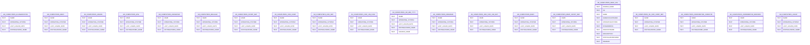

# ERD Landing Layer

```mermaid
erDiagram
    %% LANDING Layer
    AD_COMPUTERS_ALUNGRIFFITHS {
        TEXT NAME
        TEXT OPERATING_SYSTEM
        TEXT LAST_LOGON_DATE
        TEXT DISTINGUISHED_NAME
    }
    AD_COMPUTERS_AMAT {
        TEXT NAME
        TEXT OPERATING_SYSTEM
        TEXT LAST_LOGON_DATE
        TEXT DISTINGUISHED_NAME
    }
    AD_COMPUTERS_ANCON {
        TEXT NAME
        TEXT OPERATING_SYSTEM
        TEXT LAST_LOGON_DATE
        TEXT DISTINGUISHED_NAME
    }
    AD_COMPUTERS_APG {
        TEXT NAME
        TEXT OPERATING_SYSTEM
        TEXT LAST_LOGON_DATE
        TEXT DISTINGUISHED_NAME
    }
    AD_COMPUTERS_ASHGROVE {
        TEXT NAME
        TEXT OPERATING_SYSTEM
        TEXT LAST_LOGON_DATE
        TEXT DISTINGUISHED_NAME
    }
    AD_COMPUTERS_BELGIUM {
        TEXT NAME
        TEXT OPERATING_SYSTEM
        TEXT LAST_LOGON_DATE
        TEXT DISTINGUISHED_NAME
    }
    AD_COMPUTERS_CRHPP_NET {
        TEXT NAME
        TEXT OPERATING_SYSTEM
        TEXT LAST_LOGON_DATE
        TEXT DISTINGUISHED_NAME
    }
    AD_COMPUTERS_CRH_CORP {
        TEXT NAME
        TEXT OPERATING_SYSTEM
        TEXT LAST_LOGON_DATE
        TEXT DISTINGUISHED_NAME
    }
    AD_COMPUTERS_CRH_NET {
        TEXT NAME
        TEXT OPERATING_SYSTEM
        TEXT LAST_LOGON_DATE
        TEXT DISTINGUISHED_NAME
    }
    AD_COMPUTERS_CRH_UNI_COM {
        TEXT NAME
        TEXT OPERATING_SYSTEM
        TEXT LAST_LOGON_DATE
        TEXT DISTINGUISHED_NAME
    }
    AD_COMPUTERS_DD_MM_YYYY {
        TEXT NAME
        TEXT OPERATING_SYSTEM
        TEXT LAST_LOGON_DATE
        TEXT DISTINGUISHED_NAME
        TEXT SOURCE_NAME
    }
    AD_COMPUTERS_DENMARK {
        TEXT NAME
        TEXT OPERATING_SYSTEM
        TEXT LAST_LOGON_DATE
        TEXT DISTINGUISHED_NAME
    }
    AD_COMPUTERS_DEV_CRH_UNI_NET {
        TEXT NAME
        TEXT OPERATING_SYSTEM
        TEXT LAST_LOGON_DATE
        TEXT DISTINGUISHED_NAME
    }
    AD_COMPUTERS_EMAT {
        TEXT NAME
        TEXT OPERATING_SYSTEM
        TEXT LAST_LOGON_DATE
        TEXT DISTINGUISHED_NAME
    }
    AD_COMPUTERS_EMAT_CRHPP_NET {
        TEXT NAME
        TEXT OPERATING_SYSTEM
        TEXT LAST_LOGON_DATE
        TEXT DISTINGUISHED_NAME
    }
    AD_COMPUTERS_EMAT_HCL {
        TEXT DOMAIN_NAME
        TEXT OU
        TEXT NAME
        TEXT SAMACCOUNTNAME
        TEXT OPERATINGSYSTEM
        TEXT IPV4ADDRESS
        TEXT DNSHOSTNAME
        TEXT DESCRIPTION
        TEXT DISTINGUISHEDNAME
        TEXT ENABLED
    }
    AD_COMPUTERS_EU_CRH_CORP_NET {
        TEXT NAME
        TEXT OPERATING_SYSTEM
        TEXT LAST_LOGON_DATE
        TEXT DISTINGUISHED_NAME
    }
    AD_COMPUTERS_FERROBETON_COMPUTE {
        TEXT NAME
        TEXT OPERATING_SYSTEM
        TEXT LAST_LOGON_DATE
        TEXT DISTINGUISHED_NAME
    }
    AD_COMPUTERS_FERROBETON_SERVERS {
        TEXT NAME
        TEXT OPERATING_SYSTEM
        TEXT LAST_LOGON_DATE
        TEXT DISTINGUISHED_NAME
    }
    AD_COMPUTERS_LEVIAT {
        TEXT NAME
        TEXT OPERATING_SYSTEM
        TEXT LAST_LOGON_DATE
        TEXT DISTINGUISHED_NAME
    }
```