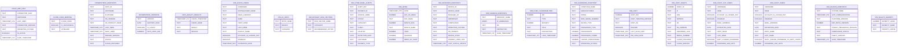

# ERD Transformation Layer

```mermaid
erDiagram
    %% TRANSFORMATION Layer
    CISCO_AMP_DATA {
        TEXT CONNECTOR_GUID
        TEXT HOSTNAME
        TIMESTAMP_NTZ LAST_SEEN
        TEXT CONNECTOR_VERSION
        TEXT OPERATING_SYSTEM
        BOOLEAN IS_ACTIVE
        TIMESTAMP_LTZ LOAD_TIMESTAMP
    }
    CLOSE_CODE_MAPPING {
        TEXT CLOSE_CODE
        BOOLEAN IS_SUCCESSFUL
        TEXT CATEGORY
    }
    CROWDSTRIKE_ENDPOINTS {
        TEXT HOST_ID
        TEXT HOSTNAME
        TEXT PLATFORM
        TEXT OS_VERSION
        TEXT OS_PRODUCT_NAME
        TIMESTAMP_NTZ LAST_SEEN
        TIMESTAMP_NTZ FIRST_SEEN
        TEXT SENSOR_VERSION
        TEXT STATUS
        TEXT CLOUD_PROVIDER
    }
    CROWDSTRIKE_VERSIONS {
        TEXT VERSION
        DATE SUPPORT_DATE
        BOOLEAN IS_LATEST
        NUMBER DAYS_UNTIL_EOL
    }
    DATA_QUALITY_RESULTS {
        TIMESTAMP_LTZ CHECK_TIMESTAMP
        TEXT CHECK_NAME
        TEXT RESULT
        TEXT DETAILS
    }
    DIM_ANCON_USERS {
        TEXT USERNAME
        TEXT DISTINGUISHED_NAME
        TEXT EMAIL_ADDRESS
        TEXT NAME
        TEXT FIRST_NAME
        TEXT LAST_NAME
        TEXT DISPLAY_NAME
        BOOLEAN ACCOUNT_IS_LOCKED_OUT
        BOOLEAN DISABLED
        TIMESTAMP_NTZ EXPIRATION_DATE
    }
    DIM_AV_OPCO {
        TEXT OPCO_NAME
        TEXT REGION
        TEXT CATEGORY
    }
    DIM_BITSIGHT_RISK_VECTORS {
        TEXT RISK_VECTOR_LABEL
        TEXT CATEGORY
        TEXT RECOMMENDED_ACTION
    }
    DIM_CYBELANGEL_ALERTS {
        TEXT ALERT_KEY
        TEXT INCIDENT_ID
        TEXT SOURCE_NAME
        TEXT STATUS
        TEXT CATEGORY
        TEXT CLIENT
        TEXT COUNTRY
        DATE DETECTION_DATE
        TEXT HOSTNAME
        TEXT INCIDENT_TYPE
    }
    DIM_DATES {
        TIMESTAMP_NTZ DATE
        NUMBER DAY_OF_WEEK
        TEXT DAY_NAME
        NUMBER MONTH_NUM
        TEXT MONTH_NAME
        NUMBER YEAR
        NUMBER QUARTER
        NUMBER WEEK_OF_YEAR
    }
    DIM_DEFENDER_ENDPOINTS {
        TEXT DEVICE_ID
        TEXT DEVICE_NAME
        TEXT MANAGED_BY
        TEXT OWNERSHIP
        TEXT COMPLIANCE
        TEXT OPERATING_SYSTEM
        TEXT OS_VERSION
        TEXT DEVICE_STATE
        TEXT PRIMARY_USER_UPN
        TIMESTAMP_NTZ LAST_STATUS_UPDATE
    }
    DIM_FARRANS_ENDPOINTS {
        TEXT ENDPOINT_NAME
        ARRAY IP_ADDRESSES
        TEXT OS
        TEXT PROTECTION
        TIMESTAMP_LTZ LOAD_TIMESTAMP
    }
    DIM_FIXED_VULNERABILITIES {
        NUMBER QID
        TEXT TYPE
        NUMBER SEVERITY
        TEXT TITLE
        TEXT DESCRIPTION
        TIMESTAMP_LTZ LOAD_TIMESTAMP
    }
    DIM_HARDWARE_INVENTORY {
        TEXT COMPUTER_NAME
        TEXT MANUFACTURER
        TEXT MODEL
        TEXT BIOS_SERIAL_NUMBER
        TEXT DEVICE_TYPE
        TEXT PROCESSOR_TYPE
        NUMBER PROCESSORS
        NUMBER PROCESSOR_CORES
        NUMBER LOGICAL_PROCESSORS
        TEXT OPERATING_SYSTEM
    }
    DIM_HOST {
        NUMBER HOST_KEY
        TEXT HOST_TRACKING_METHOD
        TEXT HOST_OS
        BOOLEAN INSCOPE
        TIMESTAMP_NTZ LAST_SCAN_DATE
        TIMESTAMP_NTZ DW_LOAD_DATE
    }
    DIM_HOST_ASSETS {
        NUMBER ASSET_ID
        TEXT IP
        TEXT DNS
        TEXT NETBIOS
        TEXT OS
        TEXT OS_VERSION
        TEXT HARDWARE_UUID
        TEXT SERIAL_NUMBER
        TEXT CLOUD_PROVIDER
        TEXT CLOUD_SERVICE
    }
    DIM_LEVIAT_LIST_USERS {
        TEXT USERNAME
        TEXT NAME
        BOOLEAN ACCOUNT_IS_LOCKED_OUT
        BOOLEAN DISABLED
        TEXT EMAIL_ADDRESS
        DATE EXPIRATION_DATE
        TEXT FIRST_NAME
        TEXT LAST_NAME
        BOOLEAN MUST_CHANGE_PASSWORD
        NUMBER PASSWORD_AGE_DAYS
    }
    DIM_LEVIAT_USERS {
        TEXT USERNAME
        TEXT NAME
        BOOLEAN ACCOUNT_IS_LOCKED_OUT
        BOOLEAN DISABLED
        TEXT EMAIL_ADDRESS
        DATE EXPIRATION_DATE
        TEXT FIRST_NAME
        TEXT LAST_NAME
        BOOLEAN MUST_CHANGE_PASSWORD_AT_NEXT_LOGON
        NUMBER PASSWORD_AGE_DAYS
    }
    DIM_MCAFEE_ENDPOINTS {
        TEXT SYSTEM_NAME
        TIMESTAMP_NTZ LAST_COMMUNICATION
        TEXT PLATFORM_VERSION
        NUMBER ESP_PATCH_VERSION
        TEXT THREAT_PREVENTION_VERSION
        TEXT COMPLIANCE_STATUS
        TEXT AGENT_VERSION
        TIMESTAMP_LTZ LOAD_TIMESTAMP
    }
    DIM_QUALYS_SEVERITY {
        NUMBER SEVERITY_LEVEL
        TEXT SEVERITY_NAME
        TEXT PRIORITY_GROUP
    }
```