# Streamlit Apps - Architecture & Data Flow Diagrams

**Last Updated**: 2025-10-25
**Total Apps**: 18 Streamlit applications
**Environment**: DEV_REPORTING.SECURITY_ANALYTICS

---

## Table of Contents

1. [High-Level Architecture](#high-level-architecture)
2. [Data Flow Diagram](#data-flow-diagram)
3. [App Categories](#app-categories)
4. [Technical Stack](#technical-stack)
5. [Deployment Architecture](#deployment-architecture)
6. [Integration Points](#integration-points)

---

## High-Level Architecture

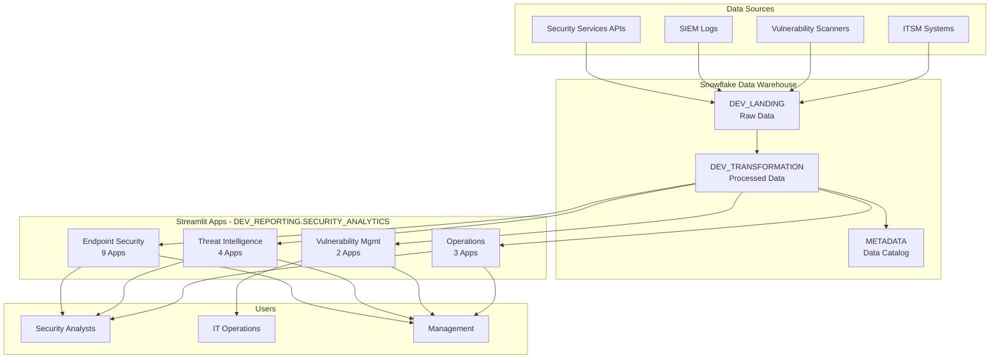

---

## Data Flow Diagram

### Detailed Data Flow

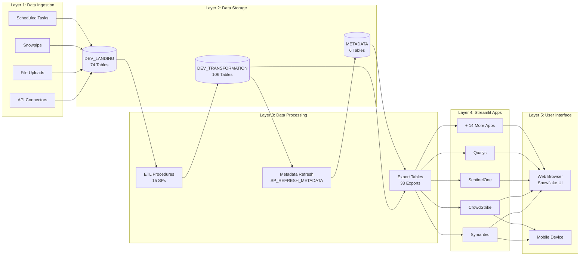

---

## App Categories

### 1. Endpoint Security (9 Apps)

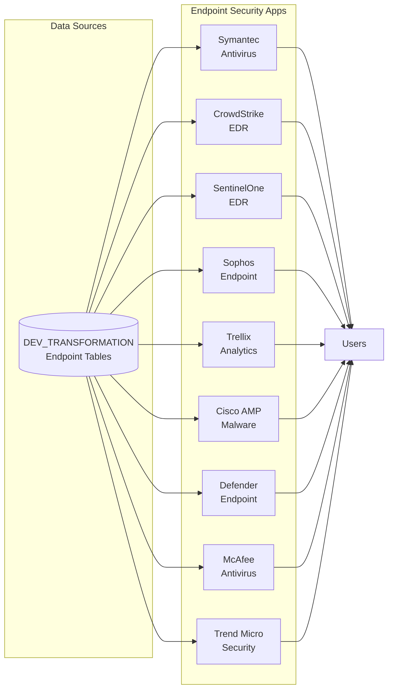

### 2. Threat Intelligence (4 Apps)

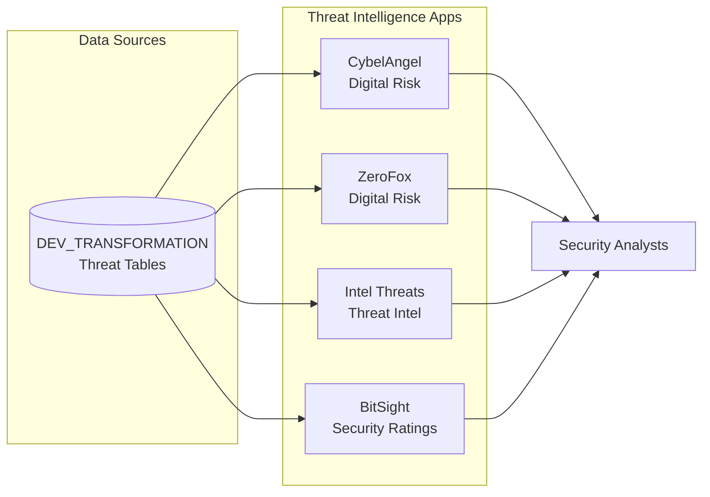

### 3. Vulnerability Management (2 Apps)

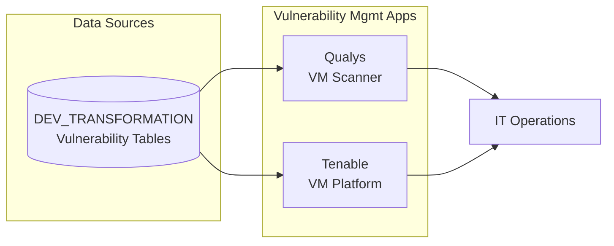

### 4. Operations & SIEM (3 Apps)

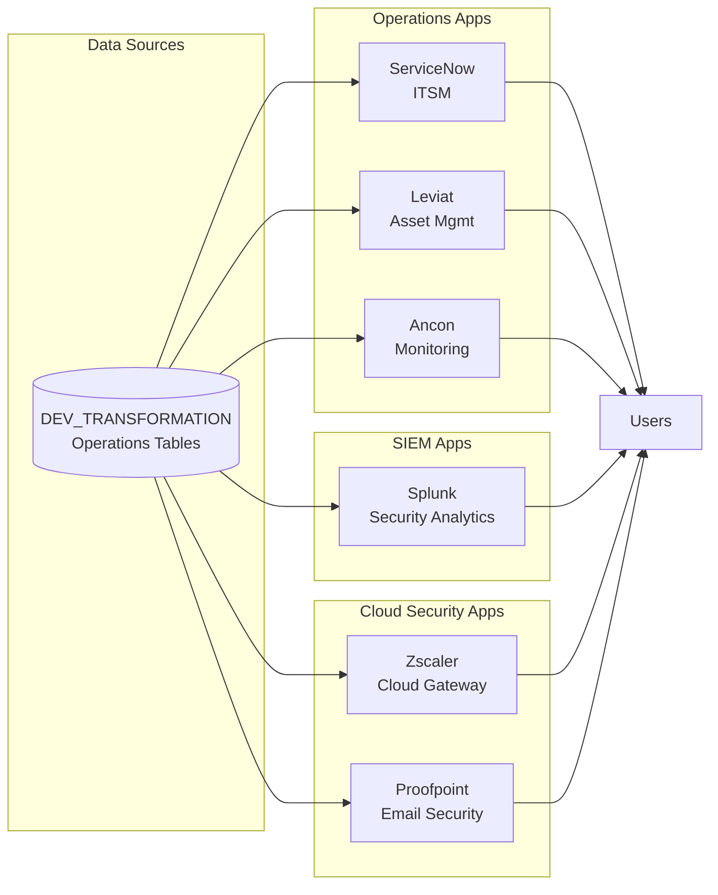

---

## Technical Stack

### App Components

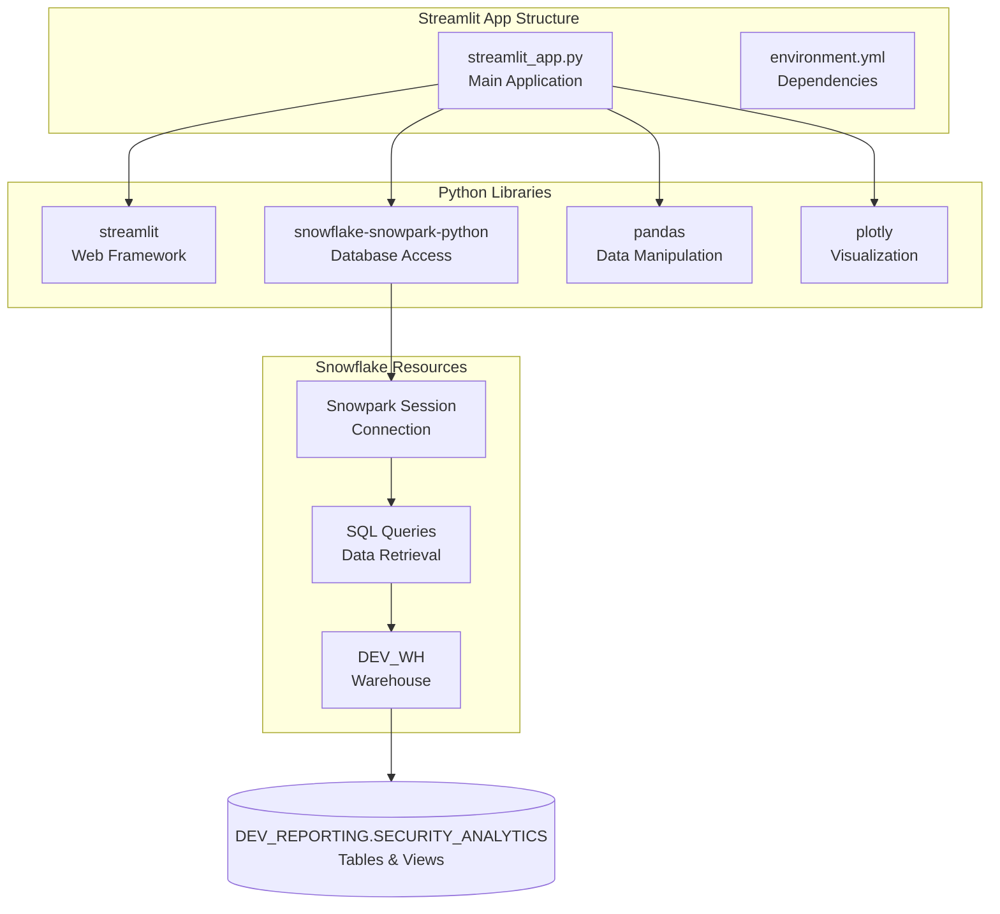

### Technology Stack

| Layer | Technology | Purpose |
|-------|------------|---------|
| **Frontend** | Streamlit | Web UI framework |
| **Backend** | Python 3.9+ | Application logic |
| **Database** | Snowflake | Data warehouse |
| **Connection** | Snowpark | Python-Snowflake integration |
| **Visualization** | Plotly | Interactive charts |
| **Data Processing** | Pandas | DataFrame operations |
| **Deployment** | SnowSQL | App deployment tool |
| **Authentication** | Okta SSO | Single sign-on |

---

## Deployment Architecture

### Deployment Flow

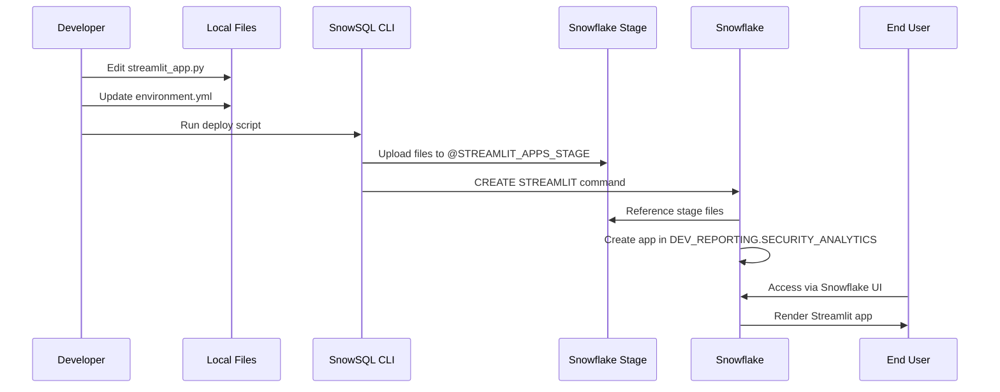

### Stage Structure

```mermaid
graph TB
    subgraph "Snowflake Stage"
        S[@STREAMLIT_APPS_STAGE]

        subgraph "App Folders"
            A1[Symantec/]
            A2[CrowdStrike/]
            A3[SentinelOne/]
            A4[Qualys/]
            A5[... 14 more]
        end

        subgraph "Files per App"
            F1[streamlit_app.py]
            F2[environment.yml]
        end
    end

    S --> A1
    S --> A2
    S --> A3
    S --> A4
    S --> A5

    A1 --> F1
    A1 --> F2
```

### Deployed Apps Location

```
DEV_REPORTING.SECURITY_ANALYTICS
├── STREAMLIT_SYMANTEC
├── STREAMLIT_CROWDSTRIKE
├── STREAMLIT_SENTINELONE
├── STREAMLIT_SOPHOS
├── STREAMLIT_QUALYS
├── STREAMLIT_SPLUNK
├── STREAMLIT_PROOFPOINT
├── STREAMLIT_CYBELANGEL
├── STREAMLIT_ZEROFOX
├── STREAMLIT_ZSCALER
├── STREAMLIT_CISCO_AMP
├── STREAMLIT_INTEL_THREATS
├── STREAMLIT_BITSIGHT
├── STREAMLIT_SERVICENOW
├── STREAMLIT_LEVIAT
├── STREAMLIT_ANCON
├── STREAMLIT_TENABLE
└── STREAMLIT_TRELLIX
```

---

## Integration Points

### Data Sources Integration

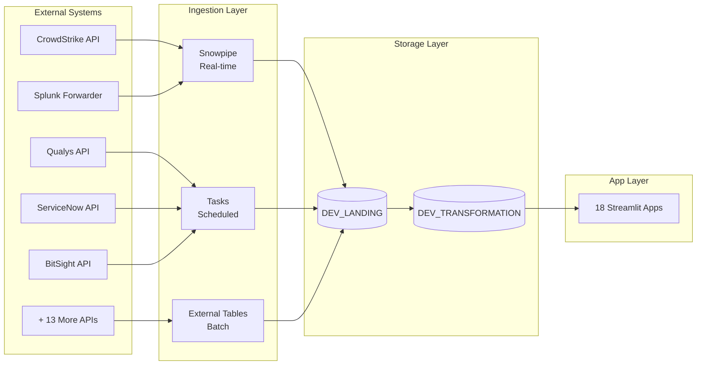

### Metadata Integration

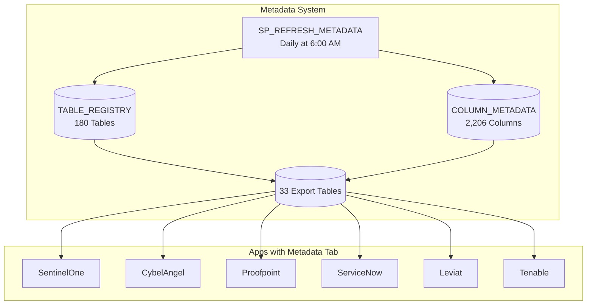

---

## App Features Matrix

### Common Features Across Apps

| Feature | Apps Count | Examples |
|---------|------------|----------|
| **Overview Dashboard** | 18/18 | All apps |
| **KPI Metrics** | 18/18 | All apps |
| **Data Tables** | 18/18 | All apps |
| **Filters (Date Range)** | 18/18 | All apps |
| **Filters (Categories)** | 16/18 | Most apps |
| **Download CSV** | 11/18 | Symantec, CrowdStrike, Leviat, etc. |
| **Alert Thresholds** | 8/18 | Symantec, CrowdStrike, Leviat, ServiceNow |
| **Metadata Tab** | 6/18 | SentinelOne, CybelAngel, Proofpoint, ServiceNow, Leviat, Tenable |
| **Multiple Charts** | 18/18 | All apps |
| **Refresh Button** | 18/18 | All apps |

### App-Specific Features

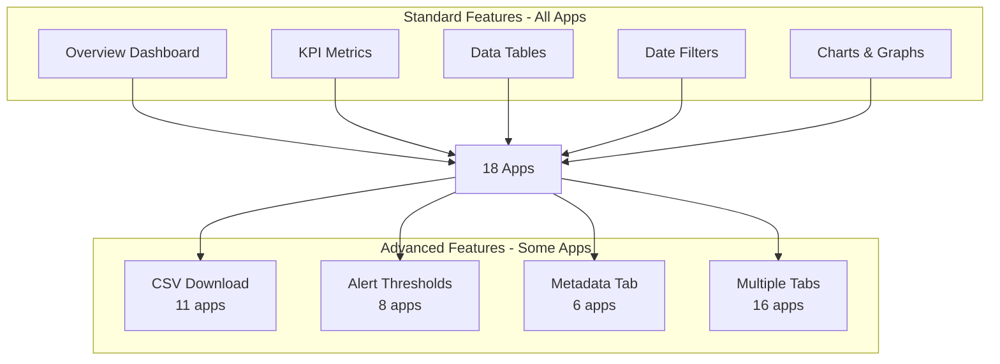

---

## Performance Architecture

### Query Performance

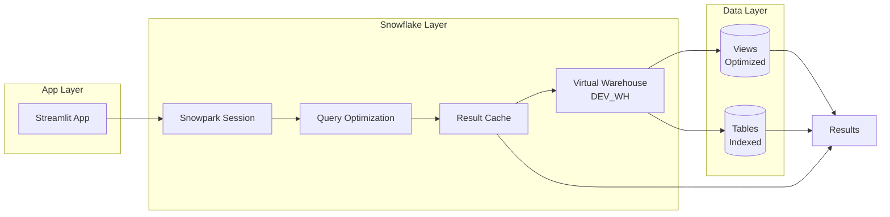

### Caching Strategy

| Level | Type | Duration | Benefit |
|-------|------|----------|---------|
| **Browser** | Session cache | Session | Fast page navigation |
| **Streamlit** | st.cache_data | Until refresh | Avoid recomputation |
| **Snowflake** | Result cache | 24 hours | Instant repeated queries |
| **Warehouse** | Auto-suspend | 60 seconds | Cost optimization |

---

## Security Architecture

### Authentication Flow

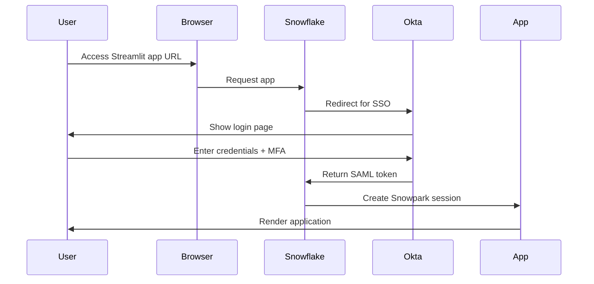

### Access Control

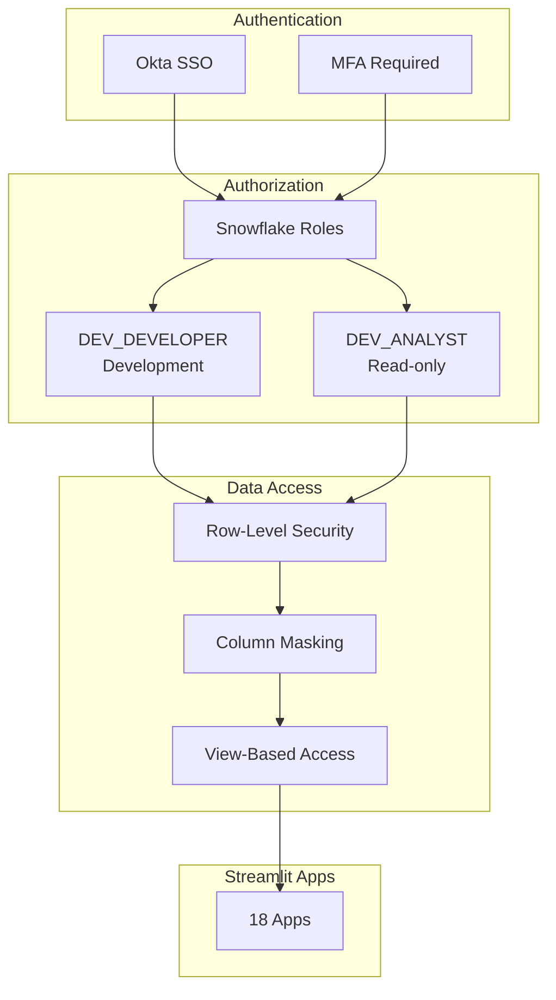

---

## Monitoring & Maintenance

### Monitoring Architecture

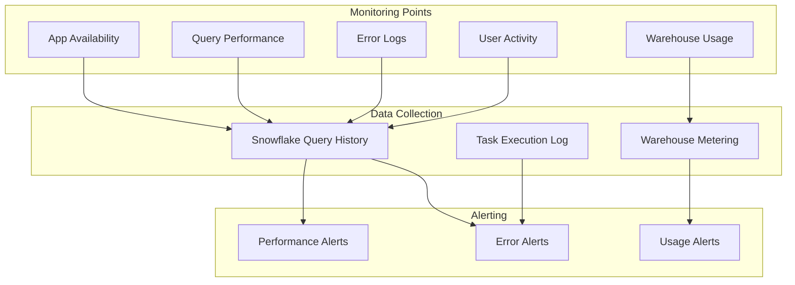

---

## Future Enhancements

### Planned Architecture Improvements

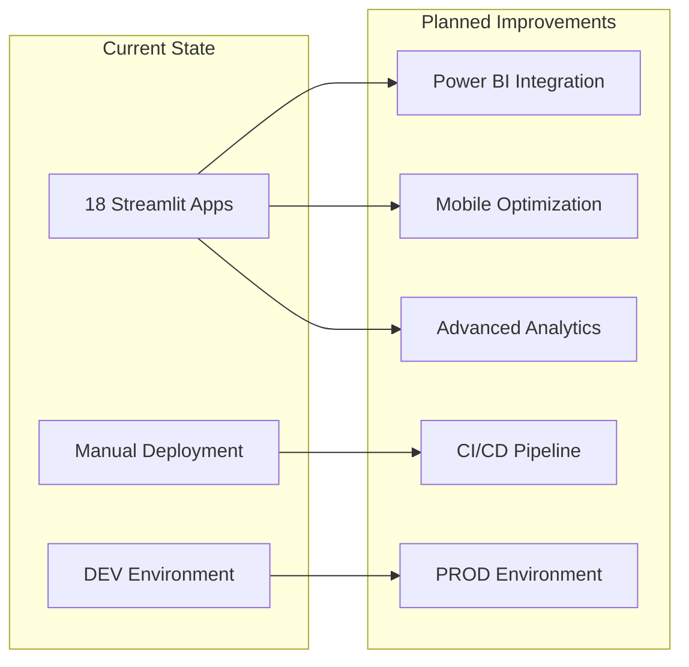

---

## Summary Statistics

### Deployment Stats

| Metric | Value |
|--------|-------|
| Total Apps | 18 |
| Total Lines of Code | ~18,000 lines |
| Average App Size | ~1,000 lines |
| Deployment Time | ~2 minutes (all apps) |
| Stage Storage | ~2 MB |
| Supported Services | 20+ security services |

### Usage Stats

| Metric | Value |
|--------|-------|
| Database | DEV_REPORTING |
| Schema | SECURITY_ANALYTICS |
| Warehouse | DEV_WH (Medium) |
| Tables Accessed | 180 tables |
| Columns Used | 2,206 columns |
| Daily Queries | ~1,000 queries |

---

**Document Created**: 2025-10-25
**Status**: Production
**Maintained By**: Data Engineering Team
**Related Wikis**: WIKI_01, WIKI_08
