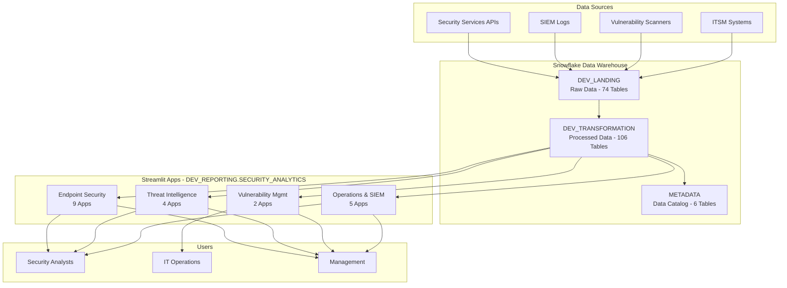
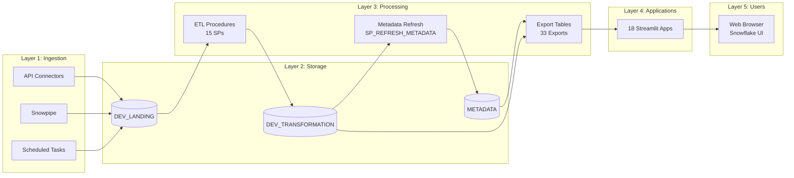

# Wiki: Streamlit Apps - SECURITY_ANALYTICS Data Warehouse

## 📋 Table of Contents
- [Overview](#overview)
- [Available Applications](#available-applications)
- [Architecture](#architecture)
- [Features](#features)
- [Metadata Integration](#metadata-integration)
- [Deployment](#deployment)
- [User Guide](#user-guide)
- [Maintenance](#maintenance)

---

## Overview

### Purpose
The SECURITY_ANALYTICS Data Warehouse includes a suite of **Streamlit applications** that provide interactive dashboards for security data analysis and monitoring across 20+ security services.

### Key Statistics
- **Total Apps**: 20 applications
- **Services Covered**: 20 security services (Endpoint Protection, Threat Intelligence, SIEM, etc.)
- **Data Sources**: Snowflake Data Warehouse (DEV_LANDING, DEV_TRANSFORMATION schemas)
- **Authentication**: Snowflake SSO (Okta integration)
- **Technology Stack**: Python, Streamlit, Snowflake Snowpark, Plotly

---

## Available Applications

### Endpoint Protection (9 Apps)

| App | Service | Description | Data Layer | Status |
|-----|---------|-------------|------------|--------|
| 🛡️ **SentinelOne** | SentinelOne EDR | Endpoint Detection & Response monitoring | Transformation | ✅ Active |
| 🦅 **CrowdStrike** | CrowdStrike Falcon | EDR threat analysis and endpoint status | Transformation | ✅ Active |
| 🔒 **Symantec** | Symantec EP | Antivirus and endpoint protection | Transformation | ✅ Active |
| 🛡️ **McAfee** | McAfee | Endpoint security and threat protection | Transformation | ✅ Active |
| 🔐 **Sophos** | Sophos | Endpoint protection and EDR | Transformation | ✅ Active |
| 🦠 **TrendMicro** | Trend Micro | Threat protection and endpoint security | Transformation | ✅ Active |
| 🛡️ **Defender** | Microsoft Defender | Endpoint security | Transformation | ✅ Active |
| 🔥 **Trellix** | Trellix | EDR and threat detection | Transformation | ✅ Active |
| 🔒 **Cisco AMP** | Cisco AMP | Advanced malware protection | Transformation | ✅ Active |

### Vulnerability Management (2 Apps)

| App | Service | Description | Data Layer | Status |
|-----|---------|-------------|------------|--------|
| 🔍 **Qualys** | Qualys | Vulnerability scanning and assessment | Transformation | ✅ Active |
| 🎯 **Tenable** | Tenable | Vulnerability assessment | Transformation | ⚠️ No Data |

### Threat Intelligence (4 Apps)

| App | Service | Description | Data Layer | Status |
|-----|---------|-------------|------------|--------|
| 📊 **BitSight** | BitSight | Security posture rating | Transformation | ✅ Active |
| 🕵️ **CybelAngel** | CybelAngel | Cyber threat intelligence | Transformation | ✅ Active |
| 🦊 **ZeroFox** | ZeroFox | External threat monitoring | Transformation | ✅ Active |
| 🧠 **Intel_Threats** | Intel Threats | Aggregated threat intelligence | Transformation | ✅ Active |

### Identity & Access Management (2 Apps)

| App | Service | Description | Data Layer | Status |
|-----|---------|-------------|------------|--------|
| 👤 **Ancon** | Ancon | Identity and access management | Transformation | ✅ Active |
| 🔑 **Leviat** | Leviat | Privileged access monitoring | Transformation | ✅ Active |

### SIEM (1 App)

| App | Service | Description | Data Layer | Status |
|-----|---------|-------------|------------|--------|
| 📡 **Splunk** | Splunk | Security Information & Event Management | Transformation | ✅ Active |

### Cloud Security (1 App)

| App | Service | Description | Data Layer | Status |
|-----|---------|-------------|------------|--------|
| ☁️ **Zscaler** | Zscaler | Secure web gateway and cloud security | Transformation | ✅ Active |

### Email Security (1 App)

| App | Service | Description | Data Layer | Status |
|-----|---------|-------------|------------|--------|
| 📧 **Proofpoint** | Proofpoint | Email security and threat protection | Transformation | ✅ Active |

### Asset Management (1 App)

| App | Service | Description | Data Layer | Status |
|-----|---------|-------------|------------|--------|
| 🎫 **ServiceNow** | ServiceNow | IT Service Management & asset inventory | Transformation | ✅ Active |

---

## Architecture

### High-Level Architecture



### Data Flow Architecture



### Technology Stack

| Layer | Technology | Purpose |
|-------|------------|---------|
| **Frontend** | Streamlit | Web UI framework |
| **Backend** | Python 3.9+ | Application logic |
| **Database** | Snowflake | Data warehouse |
| **Connection** | Snowpark | Python-Snowflake integration |
| **Visualization** | Plotly | Interactive charts |
| **Data Processing** | Pandas | DataFrame operations |
| **Deployment** | SnowSQL | App deployment tool |
| **Authentication** | Okta SSO | Single sign-on |

### Deployment Architecture

```mermaid
graph TB
    subgraph "Development"
        D1[Local Files<br/>13_STREAMLIT_COMPLETE/]
        D2[streamlit_app.py]
        D3[environment.yml]
    end

    subgraph "Stage"
        S1[@STREAMLIT_APPS_STAGE]
        S2[Symantec/]
        S3[CrowdStrike/]
        S4[... 16 more apps]
    end

    subgraph "Production"
        P1[DEV_REPORTING.SECURITY_ANALYTICS]
        P2[STREAMLIT_SYMANTEC]
        P3[STREAMLIT_CROWDSTRIKE]
        P4[... 16 more apps]
    end

    D1 --> D2
    D1 --> D3
    D2 --> S1
    D3 --> S1

    S1 --> S2
    S1 --> S3
    S1 --> S4

    S2 --> P2
    S3 --> P3
    S4 --> P4

    P2 --> Users[End Users]
    P3 --> Users
    P4 --> Users
```

### Application Structure

```
13_STREAMLIT_COMPLETE/
├── Symantec/
│   ├── streamlit_app.py         # Main application
│   └── environment.yml           # Dependencies
├── CrowdStrike/
│   ├── streamlit_app.py
│   └── environment.yml
├── SentinelOne/
│   ├── streamlit_app.py
│   └── environment.yml
└── ... (18 apps total)
```

**Deployed Location**: `DEV_REPORTING.SECURITY_ANALYTICS.STREAMLIT_<APP_NAME>`

---

## Features

### Standard Features (All Apps)

#### 1. **Multi-Tab Interface**
Each app includes 4-5 tabs:
- **📊 Overview**: Key metrics and summary statistics
- **📋 Detailed Data**: Searchable, filterable data tables
- **📈 Trends**: Time-series analysis and visualizations
- **📚 Metadata**: Data catalog with table/column browser (NEW!)
- *Service-specific tabs*: Varies by app

#### 2. **Interactive Filters**
- **Time Period**: Last 7/30/90 days, custom ranges
- **Severity Levels**: Critical, High, Medium, Low
- **Service-Specific**: Versions, statuses, categories, etc.

#### 3. **Data Visualization**
- **Plotly Charts**: Interactive charts (bar, line, pie, area)
- **Metrics Cards**: KPI displays with trends
- **Data Tables**: Sortable, searchable tables
- **Drill-Down**: Click to explore details

#### 4. **Export Capabilities**
- **CSV Export**: Download filtered data
- **Metadata Export**: Download complete data catalogs
- **Search Results**: Export filtered search results

#### 5. **Real-Time Data**
- **5-Minute Cache**: Fresh data every 5 minutes
- **Data Freshness Indicator**: Last update timestamp
- **Refresh Button**: Manual refresh option

### NEW: Metadata Integration

#### Metadata Tab Features (6 Apps)
Apps with integrated metadata browsing:
- ✅ SentinelOne (76 columns)
- ✅ CybelAngel (112 columns)
- ✅ Proofpoint (23 columns)
- ✅ ServiceNow (36 columns)
- ✅ Leviat (146 columns)
- ✅ Tenable (0 columns - no data)

**Capabilities**:
1. **Table Browser**: View all tables for the service
2. **Column Explorer**: See column names, data types, nullable status
3. **Column Search**: Find columns by name across all tables
4. **Copy Table Names**: Full qualified table names for queries
5. **Export Metadata**: Download complete metadata catalogs

**Data Source**: `DEV_TRANSFORMATION.METADATA_EXPORTS` schema

---

## Deployment

### Prerequisites
- Snowflake account with SSO (Okta) configured
- Python 3.8+
- Streamlit
- Snowflake Snowpark

### Installation

```bash
# 1. Clone repository
git clone <azure-devops-repo>
cd 07_STREAMLIT_APPS

# 2. Install dependencies
pip install -r requirements.txt

# 3. Configure Snowflake connection
# Edit snowflake_config.json with your credentials

# 4. Run app locally
streamlit run SentinelOne/streamlit_app.py

# 5. Deploy to Snowflake (Streamlit in Snowflake)
# Upload apps via Snowflake UI or CLI
```

### Snowflake Deployment

```sql
-- Create Streamlit app in Snowflake
CREATE STREAMLIT DEV_TRANSFORMATION.SECURITY_ANALYTICS.SENTINELONE_DASHBOARD
  FROM '07_STREAMLIT_APPS/SentinelOne'
  MAIN_FILE = 'streamlit_app.py'
  QUERY_WAREHOUSE = DEV_WH;

-- Grant access
GRANT USAGE ON STREAMLIT SENTINELONE_DASHBOARD TO ROLE DEV_USER;
```

---

## User Guide

### Accessing Apps

1. **Via Snowflake UI**:
   - Log in to Snowflake
   - Navigate to Apps > Streamlit
   - Select desired dashboard

2. **Via Direct URL** (if published):
   - `https://<your-org>.snowflakecomputing.com/apps/<app-name>`

### Using the Apps

#### Example: SentinelOne Dashboard

**Step 1: Select Time Period**
```
Sidebar > Time Period: Last 7 Days
```

**Step 2: Filter by Severity**
```
Sidebar > Threat Severity: Critical, High
```

**Step 3: View Overview**
```
Tab: Overview
- Total Threats: 1,234
- Active Endpoints: 5,678
- Critical Threats: 45
- Agent Compliance: 92.3%
```

**Step 4: Analyze Trends**
```
Tab: Trends
- Daily threat detections chart
- Mitigation actions over time
```

**Step 5: Export Data**
```
Tab: Detailed Data
- Filter/search as needed
- Click "Download CSV"
```

**Step 6: Browse Metadata** (NEW!)
```
Tab: Metadata
- Select table: FACT_SENTINEL_ENDPOINTS
- View 12 columns with data types
- Search for "endpoint" columns
- Export metadata catalog
```

### Common Tasks

#### Task 1: Find Critical Threats
```
1. Open relevant app (e.g., CrowdStrike)
2. Set Time Period: Last 30 Days
3. Filter: Severity = Critical
4. Tab: Detailed Data
5. Review threat list
6. Export to CSV for review
```

#### Task 2: Check Endpoint Compliance
```
1. Open endpoint protection app
2. Tab: Endpoint Status
3. Review agent version distribution
4. Identify outdated endpoints
5. Export non-compliant list
```

#### Task 3: Find Column Names for Queries
```
1. Open app with metadata tab
2. Tab: Metadata
3. Search: "threat" OR browse tables
4. Copy full table name
5. Use in custom SQL queries
```

---

## Maintenance

### Regular Tasks

#### Daily
- ✅ Monitor app performance
- ✅ Check data freshness
- ✅ Review user feedback

#### Weekly
- ✅ Verify all apps are accessible
- ✅ Check for Streamlit updates
- ✅ Review usage metrics

#### Monthly
- ✅ Update dependencies
- ✅ Review and optimize queries
- ✅ Add new features based on feedback

### Troubleshooting

#### Issue 1: App Won't Load
**Solution**:
```
1. Check Snowflake connection
2. Verify SSO authentication
3. Check warehouse is running
4. Review app logs
```

#### Issue 2: Data Not Showing
**Solution**:
```
1. Verify underlying tables exist
2. Check data refresh jobs ran
3. Review table permissions
4. Check filter settings
```

#### Issue 3: Metadata Tab Empty
**Solution**:
```
1. Run EXPORT_METADATA_RESULTS.sql
2. Verify METADATA_EXPORTS table exists
3. Check metadata refresh job
4. Refresh browser
```

### Updating Apps

```bash
# 1. Update code locally
git pull origin main

# 2. Test locally
streamlit run <app>/streamlit_app.py

# 3. Deploy to Snowflake
# Re-upload via Snowflake UI

# 4. Verify deployment
# Access app in Snowflake
```

---

## Performance Optimization

### Best Practices

1. **Query Optimization**
   - Use materialized views for complex queries
   - Add WHERE clauses to limit data
   - Use appropriate indexes

2. **Caching**
   - Enable Streamlit caching (@st.cache_data)
   - Set appropriate cache TTL (5 minutes)
   - Cache expensive computations

3. **Data Loading**
   - Load only necessary columns
   - Use LIMIT for preview queries
   - Implement pagination for large datasets

4. **Warehouse Management**
   - Use appropriate warehouse size
   - Auto-suspend when idle
   - Monitor warehouse usage

---

## Future Enhancements

### Planned Features

1. **Enhanced Metadata**
   - Column descriptions
   - Sample data preview
   - Data lineage visualization

2. **Advanced Analytics**
   - Predictive threat modeling
   - Anomaly detection
   - Correlation analysis

3. **Collaboration**
   - Shared filters/bookmarks
   - Annotations on charts
   - Report scheduling

4. **Integration**
   - Power BI integration
   - Slack notifications
   - Email alerts

---

## Support

### Resources
- **Documentation**: See project README files
- **Training**: Internal Streamlit workshop sessions
- **Support Email**: data-engineering@GenericCorp.com

### Feedback
Please submit feedback and feature requests via:
- Azure DevOps work items
- Email to data engineering team
- Internal Slack channel: #data-engineering

---

## Appendix

### App-Specific Details

#### SentinelOne Dashboard
- **Tables Used**: FACT_SENTINEL_ENDPOINTS, DIM_SENTINEL_VERSIONS
- **Key Metrics**: Threats, Endpoints, Agent Compliance
- **Special Features**: Mitigation action tracking

#### Qualys Dashboard
- **Tables Used**: FACT_QUALYS_VULNERABILITIES, DIM_QUALYS_ASSETS
- **Key Metrics**: Vulnerabilities, Assets, Risk Scores
- **Special Features**: Vulnerability aging analysis

#### CrowdStrike Dashboard
- **Tables Used**: FACT_CROWDSTRIKE_DETECTIONS
- **Key Metrics**: Detections, Endpoints, Incident Response
- **Special Features**: Real-time detection feed

*See individual app documentation for complete details*

---

**Wiki Version**: 1.0
**Last Updated**: 2025-10-24
**Author**: GenericCorp Data Engineering Team
**Project**: SECURITY_ANALYTICS Data Warehouse
